# 📂 NFLDataLoader API Reference

Complete API documentation for the data loading module.

---

## Overview

```python
from nfl_rai import NFLDataLoader
```

The `NFLDataLoader` class handles loading and preprocessing of NFL tracking data from all 18 weeks of the 2023 season.

---

## Class Definition

```python
class NFLDataLoader:
    """
    Comprehensive data loader for NFL tracking data.
    
    Loads input (pre-throw state), output (post-throw positions),
    and supplementary play-level data.
    """
```

---

## Constructor

### `__init__(data_dir: str = None)`

Initialize the data loader.

**Parameters:**

| Parameter | Type | Default | Description |
|-----------|------|---------|-------------|
| `data_dir` | `str` | `None` | Path to the analytics-NFL directory. If None, uses current directory. |

**Example:**

```python
# Default initialization (uses current directory)
loader = NFLDataLoader()

# Custom data directory
loader = NFLDataLoader('/path/to/analytics-NFL')
```

**Attributes Set:**

| Attribute | Type | Description |
|-----------|------|-------------|
| `data_dir` | `Path` | Resolved data directory path |
| `input_df` | `DataFrame` | Pre-throw tracking data (None until loaded) |
| `output_df` | `DataFrame` | Post-throw tracking data (None until loaded) |
| `supplementary_df` | `DataFrame` | Play metadata (None until loaded) |

---

## Methods

### `load_all_weeks(weeks: List[int] = None, verbose: bool = True) → DataFrame`

Load all weeks of tracking data.

**Parameters:**

| Parameter | Type | Default | Description |
|-----------|------|---------|-------------|
| `weeks` | `List[int]` | `None` | Specific weeks to load (1-18). None = all weeks. |
| `verbose` | `bool` | `True` | Show progress bar during loading |

**Returns:** Merged DataFrame with all tracking data

**Example:**

```python
# Load all weeks
loader.load_all_weeks()

# Load specific weeks only
loader.load_all_weeks(weeks=[1, 2, 3])

# Silent loading
loader.load_all_weeks(verbose=False)
```

**Data Flow:**


---

### `load_supplementary() → DataFrame`

Load supplementary play-level data.

**Returns:** DataFrame with play metadata

**Example:**

```python
loader.load_supplementary()
print(loader.supplementary_df.columns)
# ['gameId', 'playId', 'quarter', 'down', 'yardsToGo', 'coverage', ...]
```

---

### `create_play_dataset() → DataFrame`

Create a comprehensive play-level dataset by merging all sources.

**Returns:** DataFrame with one row per play, containing aggregated metrics

**Example:**

```python
plays_df = loader.create_play_dataset()
print(f"Total plays: {len(plays_df)}")
```

---

### `get_play_tracking(game_id: int, play_id: int) → Tuple[DataFrame, DataFrame]`

Get input and output tracking data for a specific play.

**Parameters:**

| Parameter | Type | Description |
|-----------|------|-------------|
| `game_id` | `int` | Game identifier (e.g., 2023090700) |
| `play_id` | `int` | Play identifier within the game |

**Returns:** Tuple of `(input_df, output_df)` for the specified play

**Example:**

```python
input_df, output_df = loader.get_play_tracking(2023090700, 101)

print(f"Input frames: {len(input_df)}")   # Pre-throw state
print(f"Output frames: {len(output_df)}") # Post-throw tracking
```

**Output Structure:**


---

### `get_player_frames(game_id: int, play_id: int, nfl_id: int) → Tuple[DataFrame, DataFrame]`

Get frame-by-frame data for a specific player in a play.

**Parameters:**

| Parameter | Type | Description |
|-----------|------|-------------|
| `game_id` | `int` | Game identifier |
| `play_id` | `int` | Play identifier |
| `nfl_id` | `int` | Player identifier |

**Returns:** Tuple of `(input_frames, output_frames)` for the player

**Example:**

```python
player_in, player_out = loader.get_player_frames(2023090700, 101, 35498001)
print(f"Player output frames: {len(player_out)}")
```

---

### `standardize_coordinates(df: DataFrame) → DataFrame`

Standardize field coordinates so all plays go left-to-right.

**Parameters:**

| Parameter | Type | Description |
|-----------|------|-------------|
| `df` | `DataFrame` | DataFrame with x, y columns and play_direction |

**Returns:** DataFrame with standardized coordinates

**Example:**

```python
standardized_df = loader.standardize_coordinates(raw_df)
```

**Transformation:**

```mermaid
graph LR
    subgraph before["Before"]
        B1["Plays go both<br/>directions"]
        B2["x: 0-120 yards"]
    end
    
    subgraph after["After"]
        A1["All plays go<br/>left → right"]
        A2["Offense always<br/>moving right"]
    end
    
    before --> |"Flip if needed"| after
```



---

### `get_players_to_predict(game_id: int, play_id: int) → List[int]`

Get list of NFL IDs for players that need predictions.

**Parameters:**

| Parameter | Type | Description |
|-----------|------|-------------|
| `game_id` | `int` | Game identifier |
| `play_id` | `int` | Play identifier |

**Returns:** List of NFL IDs

**Example:**

```python
player_ids = loader.get_players_to_predict(2023090700, 101)
print(f"Players to predict: {len(player_ids)}")
```

---

### `get_play_metadata(game_id: int, play_id: int) → dict`

Get metadata for a specific play from supplementary data.

**Parameters:**

| Parameter | Type | Description |
|-----------|------|-------------|
| `game_id` | `int` | Game identifier |
| `play_id` | `int` | Play identifier |

**Returns:** Dictionary with play metadata

**Example:**

```python
meta = loader.get_play_metadata(2023090700, 101)
print(f"Ball landing: ({meta['x_end']}, {meta['y_end']})")
print(f"Coverage: {meta['coverage']}")
```

**Returned Fields:**

| Field | Type | Description |
|-------|------|-------------|
| `x_end` | `float` | Ball landing X position |
| `y_end` | `float` | Ball landing Y position |
| `quarter` | `int` | Game quarter |
| `down` | `int` | Down |
| `yardsToGo` | `int` | Yards to first down |
| `coverage` | `str` | Coverage type |

---

### `summary_stats() → dict`

Get summary statistics of loaded data.

**Returns:** Dictionary with data statistics

**Example:**

```python
stats = loader.summary_stats()
for key, value in stats.items():
    print(f"{key}: {value}")
```

**Output:**

```
total_input_records: 4880579
total_output_records: 562936
unique_games: 272
unique_plays: 14108
unique_players: 1178
weeks_loaded: 18
```

---

## Complete Usage Example

```python
from nfl_rai import NFLDataLoader

# Initialize
loader = NFLDataLoader()

# Load all data
loader.load_all_weeks()
loader.load_supplementary()

# Check summary
stats = loader.summary_stats()
print(f"Loaded {stats['unique_plays']} plays")

# Get specific play
game_id = 2023090700
play_id = 101

input_df, output_df = loader.get_play_tracking(game_id, play_id)
metadata = loader.get_play_metadata(game_id, play_id)

print(f"Ball landing at: ({metadata['x_end']}, {metadata['y_end']})")
print(f"Players in play: {input_df['nflId'].nunique()}")
```

---

## Error Handling

| Error | Cause | Solution |
|-------|-------|----------|
| `FileNotFoundError` | Missing tracking files | Ensure data is in `train/` directory |
| `KeyError` | Invalid game_id/play_id | Verify IDs exist in data |
| `ValueError` | Empty data loaded | Check data files are not empty |

---

## ⏭️ Next

- **[FeatureEngineer API](feature-engineering.md)**
- **[RAICalculator API](rai-calculator.md)**
