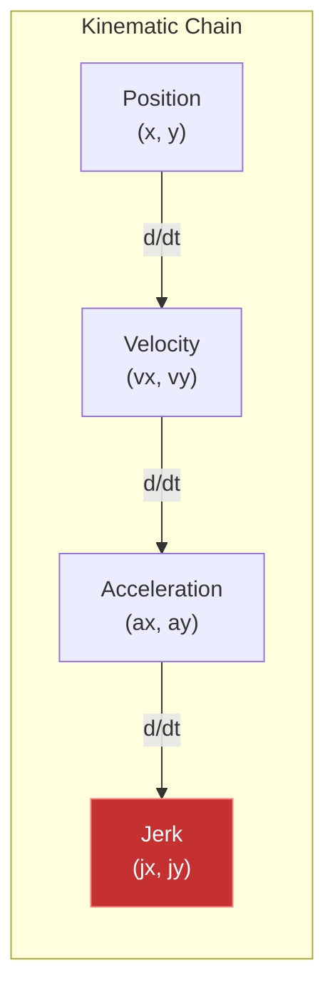
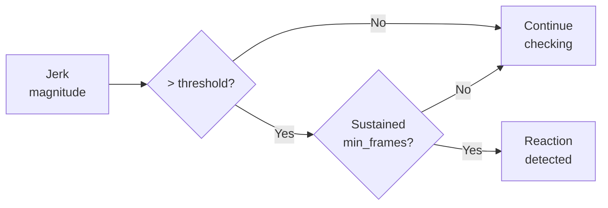

# 📐 FeatureEngineer API Reference

Complete API documentation for the physics-based feature engineering module.

---

## Overview

```python
from nfl_rai import FeatureEngineer
```

The `FeatureEngineer` class calculates derived physics and movement features from raw tracking data.

---

## Class Constants

| Constant | Value | Description |
|----------|-------|-------------|
| `FRAME_RATE` | `10` | Tracking data frequency (Hz) |
| `FRAME_INTERVAL` | `0.1` | Time between frames (seconds) |

---

## Constructor

### `__init__(smooth_sigma: float = 1.0)`

Initialize feature engineer.

**Parameters:**

| Parameter | Type | Default | Description |
|-----------|------|---------|-------------|
| `smooth_sigma` | `float` | `1.0` | Gaussian smoothing sigma for velocity/acceleration calculations |

**Example:**

```python
# Default smoothing
fe = FeatureEngineer()

# More smoothing (reduces noise but may lose detail)
fe = FeatureEngineer(smooth_sigma=2.0)

# Less smoothing (more sensitive to changes)
fe = FeatureEngineer(smooth_sigma=0.5)
```

---

## Methods

### `calculate_velocity(df: DataFrame) → DataFrame`

Calculate velocity vectors from position data.

**Parameters:**

| Parameter | Type | Description |
|-----------|------|-------------|
| `df` | `DataFrame` | DataFrame with x, y columns, sorted by frame_id |

**Returns:** DataFrame with added columns

**Added Columns:**

| Column | Type | Description |
|--------|------|-------------|
| `vx` | `float` | X-component velocity (yards/sec) |
| `vy` | `float` | Y-component velocity (yards/sec) |
| `speed` | `float` | Speed magnitude √(vx² + vy²) |
| `direction_calc` | `float` | Movement direction (degrees) |

**Formula:**

```
vx = (x[t] - x[t-1]) / Δt
vy = (y[t] - y[t-1]) / Δt
speed = √(vx² + vy²)
direction = arctan2(vy, vx) × (180/π)
```

**Example:**

```python
fe = FeatureEngineer()
df_with_velocity = fe.calculate_velocity(player_df)
print(df_with_velocity[['frame_id', 'vx', 'vy', 'speed']].head())
```

---

### `calculate_acceleration(df: DataFrame) → DataFrame`

Calculate acceleration from velocity data.

**Parameters:**

| Parameter | Type | Description |
|-----------|------|-------------|
| `df` | `DataFrame` | DataFrame with vx, vy columns |

**Returns:** DataFrame with added columns

**Added Columns:**

| Column | Type | Description |
|--------|------|-------------|
| `ax` | `float` | X-component acceleration (yards/sec²) |
| `ay` | `float` | Y-component acceleration (yards/sec²) |
| `accel_magnitude` | `float` | Acceleration magnitude |

**Formula:**

```
ax = (vx[t] - vx[t-1]) / Δt
ay = (vy[t] - vy[t-1]) / Δt
accel_magnitude = √(ax² + ay²)
```

**Example:**

```python
df = fe.calculate_velocity(player_df)
df = fe.calculate_acceleration(df)
print(df['accel_magnitude'].describe())
```

---

### `calculate_jerk(df: DataFrame) → DataFrame`

Calculate jerk (rate of acceleration change) - key reaction indicator.

**Parameters:**

| Parameter | Type | Description |
|-----------|------|-------------|
| `df` | `DataFrame` | DataFrame with ax, ay columns |

**Returns:** DataFrame with added columns

**Added Columns:**

| Column | Type | Description |
|--------|------|-------------|
| `jx` | `float` | X-component jerk |
| `jy` | `float` | Y-component jerk |
| `jerk_magnitude` | `float` | Jerk magnitude (reaction indicator) |

> [!IMPORTANT]
> High jerk values indicate sudden changes in motion — a key indicator of player reactions.

**Example:**

```python
df = fe.calculate_velocity(player_df)
df = fe.calculate_acceleration(df)
df = fe.calculate_jerk(df)

# Find reaction points
reaction_frames = df[df['jerk_magnitude'] > 5.0]
```

**Physical Interpretation:**



---

### `calculate_path_metrics(df: DataFrame) → DataFrame`

Calculate path efficiency and curvature metrics.

**Parameters:**

| Parameter | Type | Description |
|-----------|------|-------------|
| `df` | `DataFrame` | DataFrame with x, y columns |

**Returns:** DataFrame with added columns

**Added Columns:**

| Column | Type | Description |
|--------|------|-------------|
| `path_length` | `float` | Total distance traveled |
| `straight_line_dist` | `float` | Direct distance (start to end) |
| `path_efficiency` | `float` | Efficiency ratio (0-1) |
| `curvature` | `float` | Path curvature at each point |

**Formula:**

```
path_efficiency = straight_line_dist / path_length
```

**Example:**

```python
df = fe.calculate_path_metrics(player_df)
print(f"Path efficiency: {df['path_efficiency'].iloc[-1]:.2%}")
```

---

### `calculate_distance_to_point(df, target_x, target_y, col_name='dist_to_target') → DataFrame`

Calculate distance from player to a target point.

**Parameters:**

| Parameter | Type | Default | Description |
|-----------|------|---------|-------------|
| `df` | `DataFrame` | - | DataFrame with x, y columns |
| `target_x` | `float` | - | Target X coordinate |
| `target_y` | `float` | - | Target Y coordinate |
| `col_name` | `str` | `'dist_to_target'` | Name for the distance column |

**Returns:** DataFrame with added distance column

**Example:**

```python
# Calculate distance to ball landing spot
df = fe.calculate_distance_to_point(player_df, ball_x, ball_y, 'dist_to_ball')
print(df[['frame_id', 'dist_to_ball']].tail())
```

---

### `calculate_player_separation(df1, df2, merge_on='frame_id') → DataFrame`

Calculate separation distance between two players.

**Parameters:**

| Parameter | Type | Default | Description |
|-----------|------|---------|-------------|
| `df1` | `DataFrame` | - | First player tracking data |
| `df2` | `DataFrame` | - | Second player tracking data |
| `merge_on` | `str` | `'frame_id'` | Column to merge on |

**Returns:** DataFrame with frame_id and separation distance

**Example:**

```python
separation = fe.calculate_player_separation(receiver_df, defender_df)
print(f"Initial separation: {separation['separation'].iloc[0]:.1f} yards")
print(f"Final separation: {separation['separation'].iloc[-1]:.1f} yards")
```

---

### `calculate_closing_speed(df1, df2, merge_on='frame_id') → DataFrame`

Calculate closing speed between two players.

**Parameters:**

| Parameter | Type | Default | Description |
|-----------|------|---------|-------------|
| `df1` | `DataFrame` | - | First player tracking data |
| `df2` | `DataFrame` | - | Second player tracking data |
| `merge_on` | `str` | `'frame_id'` | Column to merge on |

**Returns:** DataFrame with frame_id and closing_speed

**Interpretation:**
- **Positive** = players getting closer
- **Negative** = players separating

---

### `process_player_tracking(df: DataFrame) → DataFrame`

Apply all feature calculations to player tracking data.

**Parameters:**

| Parameter | Type | Description |
|-----------|------|-------------|
| `df` | `DataFrame` | Raw tracking DataFrame for a single player, sorted by frame_id |

**Returns:** DataFrame with all derived features

**This is a convenience method that calls:**
1. `calculate_velocity()`
2. `calculate_acceleration()`
3. `calculate_jerk()`
4. `calculate_path_metrics()`

**Example:**

```python
# Process all features in one call
processed_df = fe.process_player_tracking(raw_player_df)
print(processed_df.columns.tolist())
# ['x', 'y', 'vx', 'vy', 'speed', 'ax', 'ay', 'accel_magnitude', 
#  'jx', 'jy', 'jerk_magnitude', 'path_length', 'path_efficiency', ...]
```

---

### `detect_reaction_frame(df, threshold=5.0, min_frames=2) → Optional[int]`

Detect the frame where player shows significant reaction.

**Parameters:**

| Parameter | Type | Default | Description |
|-----------|------|---------|-------------|
| `df` | `DataFrame` | - | DataFrame with jerk_magnitude column |
| `threshold` | `float` | `5.0` | Jerk threshold for reaction detection |
| `min_frames` | `int` | `2` | Minimum sustained frames above threshold |

**Returns:** Frame number of detected reaction, or `None` if no reaction

**Example:**

```python
processed_df = fe.process_player_tracking(player_df)
reaction_frame = fe.detect_reaction_frame(processed_df, threshold=5.0)

if reaction_frame:
    print(f"Reaction detected at frame {reaction_frame}")
else:
    print("No significant reaction detected")
```

**Detection Logic:**



---

### `calculate_break_quality(df, break_frame=None) → float`

Calculate route break quality for receivers.

**Parameters:**

| Parameter | Type | Default | Description |
|-----------|------|---------|-------------|
| `df` | `DataFrame` | - | Player tracking DataFrame |
| `break_frame` | `int` | `None` | Known break frame, or auto-detect |

**Returns:** Break quality score (0-1, higher is better)

**Components:**
- **Angle sharpness:** How quickly direction changes
- **Speed retention:** Percentage of speed maintained through break

**Formula:**

```
BPQ = (angle_change / 90°) × (speed_after / speed_before)
```

**Example:**

```python
processed_df = fe.process_player_tracking(receiver_df)
break_quality = fe.calculate_break_quality(processed_df)
print(f"Break quality: {break_quality:.2f}")
```

---

## Complete Pipeline Example

```python
from nfl_rai import NFLDataLoader, FeatureEngineer

# Load data
loader = NFLDataLoader()
loader.load_all_weeks(weeks=[1])
loader.load_supplementary()

# Get player data
input_df, output_df = loader.get_play_tracking(2023090700, 101)
player_df = output_df[output_df['nflId'] == 35498001].sort_values('frameId')

# Calculate all features
fe = FeatureEngineer()
processed = fe.process_player_tracking(player_df)

# Detect reaction
reaction_frame = fe.detect_reaction_frame(processed)
print(f"Reaction at frame: {reaction_frame}")

# Check efficiency
print(f"Path efficiency: {processed['path_efficiency'].iloc[-1]:.2%}")
```

---

## ⏭️ Next

- **[RAICalculator API](rai-calculator.md)**
- **[Physics Calculations](../technical/physics-calculations.md)**
