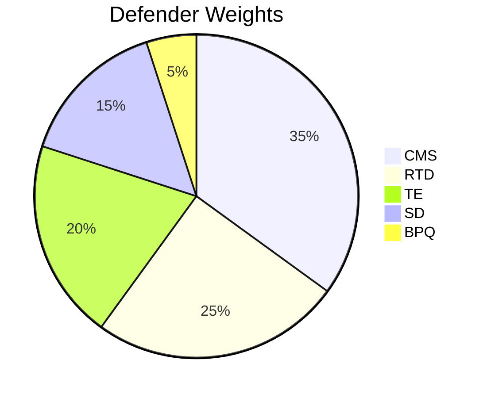
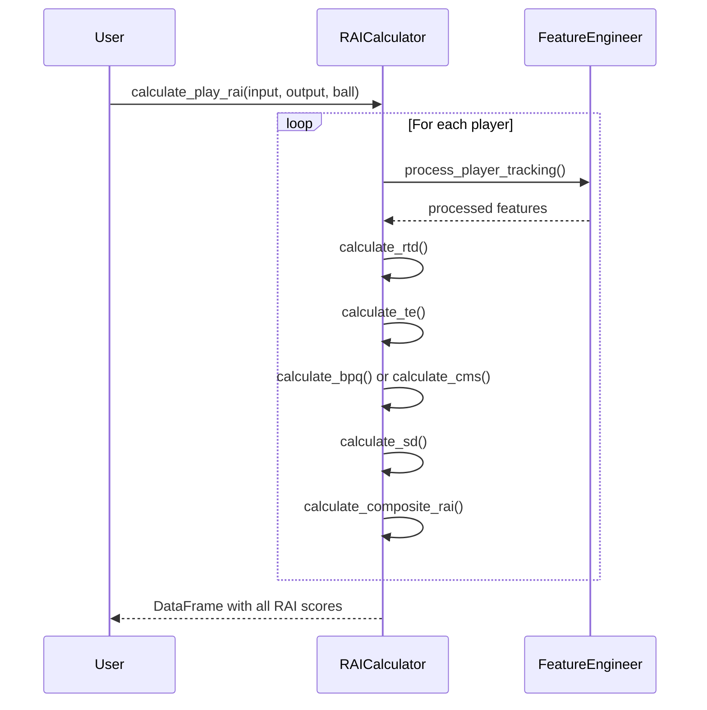

# 🎯 RAICalculator API Reference

Complete API documentation for the core RAI calculation module.

---

## Overview

```python
from nfl_rai import RAICalculator
from nfl_rai.rai_calculator import RAIComponents
```

The `RAICalculator` class computes the Reactivity Advantage Index for individual players and entire plays.

---

## RAIComponents Dataclass

```python
@dataclass
class RAIComponents:
    """Container for RAI component scores."""
    rtd: float      # Reaction Time Delay
    te: float       # Trajectory Efficiency
    bpq: float      # Break Point Quality
    cms: float      # Coverage Maintenance Score
    sd: float       # Separation Delta
    rai: float      # Composite RAI score
    player_role: str
    nfl_id: int
    
    def to_dict(self) -> dict:
        """Convert to dictionary."""
```

---

## RAICalculator Class

### Constructor

```python
def __init__(self, feature_engineer: Optional[FeatureEngineer] = None)
```

**Parameters:**

| Parameter | Type | Default | Description |
|-----------|------|---------|-------------|
| `feature_engineer` | `FeatureEngineer` | `None` | Feature engineer instance. Creates new one if None. |

**Example:**

```python
from nfl_rai import FeatureEngineer, RAICalculator

# With default feature engineer
calc = RAICalculator()

# With custom feature engineer
fe = FeatureEngineer(smooth_sigma=1.5)
calc = RAICalculator(fe)
```

---

### Class Attributes

#### `rtd_thresholds`

Role-specific thresholds for reaction detection:

```python
rtd_thresholds = {
    'defensive_coverage': 4.0,
    'targeted_receiver': 3.0,
    'pass_rush': 5.0,
    'default': 5.0
}
```

#### `weights`

Role-specific component weights:

```python
weights = {
    'defensive_coverage': {
        'rtd': -0.25, 'te': 0.20, 'bpq': 0.05, 'cms': 0.35, 'sd': 0.15
    },
    'targeted_receiver': {
        'rtd': -0.20, 'te': 0.15, 'bpq': 0.35, 'cms': 0.05, 'sd': 0.25
    },
    'pass_rush': {
        'rtd': -0.35, 'te': 0.35, 'bpq': 0.10, 'cms': 0.10, 'sd': 0.10
    },
    'default': {
        'rtd': -0.20, 'te': 0.25, 'bpq': 0.20, 'cms': 0.20, 'sd': 0.15
    }
}
```

**Weight Visualization:**



---

## Component Calculation Methods

### `calculate_rtd(player_df, player_role='default') → float`

Calculate Reaction Time Delay.

**Parameters:**

| Parameter | Type | Default | Description |
|-----------|------|---------|-------------|
| `player_df` | `DataFrame` | - | Processed player tracking DataFrame |
| `player_role` | `str` | `'default'` | Player's role for threshold selection |

**Returns:** RTD in frames (lower = faster reaction)

**Example:**

```python
rtd = calc.calculate_rtd(processed_df, 'defensive_coverage')
print(f"Reaction delay: {rtd} frames ({rtd * 100}ms)")
```

---

### `calculate_te(player_df) → float`

Calculate Trajectory Efficiency.

**Parameters:**

| Parameter | Type | Description |
|-----------|------|-------------|
| `player_df` | `DataFrame` | Processed player tracking DataFrame |

**Returns:** TE score (0-1, higher is more efficient)

**Example:**

```python
te = calc.calculate_te(processed_df)
print(f"Trajectory efficiency: {te:.2%}")
```

---

### `calculate_bpq(player_df) → float`

Calculate Break Point Quality for receivers.

**Parameters:**

| Parameter | Type | Description |
|-----------|------|-------------|
| `player_df` | `DataFrame` | Processed player tracking DataFrame |

**Returns:** BPQ score (0-1, higher is better)

**Example:**

```python
bpq = calc.calculate_bpq(receiver_df)
print(f"Break point quality: {bpq:.2f}")
```

---

### `calculate_cms(defender_df, ball_trajectory) → float`

Calculate Coverage Maintenance Score for defenders.

**Parameters:**

| Parameter | Type | Description |
|-----------|------|-------------|
| `defender_df` | `DataFrame` | Defender tracking DataFrame with direction_calc |
| `ball_trajectory` | `DataFrame` | Ball position trajectory |

**Returns:** CMS score (0-1, higher = better ball tracking)

**Example:**

```python
cms = calc.calculate_cms(defender_df, ball_df)
print(f"Coverage maintenance: {cms:.2f}")
```

---

### `calculate_sd(receiver_df, defender_df) → float`

Calculate Separation Delta.

**Parameters:**

| Parameter | Type | Description |
|-----------|------|-------------|
| `receiver_df` | `DataFrame` | Receiver tracking DataFrame |
| `defender_df` | `DataFrame` | Closest defender tracking DataFrame |

**Returns:** Separation delta in yards

**Example:**

```python
sd = calc.calculate_sd(receiver_df, defender_df)
print(f"Separation change: {sd:+.1f} yards")
```

---

## Composite Calculation Methods

### `normalize_component(value, component) → float`

Normalize a component value to z-score.

**Parameters:**

| Parameter | Type | Description |
|-----------|------|-------------|
| `value` | `float` | Raw component value |
| `component` | `str` | Component name ('rtd', 'te', 'bpq', 'cms', 'sd') |

**Returns:** Normalized z-score

---

### `calculate_composite_rai(components, player_role='default') → float`

Calculate composite RAI score from components using role-specific weights.

**Parameters:**

| Parameter | Type | Default | Description |
|-----------|------|---------|-------------|
| `components` | `dict` | - | Dict with rtd, te, bpq, cms, sd values |
| `player_role` | `str` | `'default'` | Player role for weight selection |

**Returns:** Composite RAI score

**Formula:**

```
RAI = Σ(weight[component] × normalized[component])
```

**Example:**

```python
components = {'rtd': 3.0, 'te': 0.92, 'bpq': 0.8, 'cms': 0.7, 'sd': 1.5}
rai = calc.calculate_composite_rai(components, 'defensive_coverage')
print(f"Composite RAI: {rai:.3f}")
```

---

### `calculate_player_rai(...) → RAIComponents`

Calculate complete RAI for a single player.

**Parameters:**

| Parameter | Type | Description |
|-----------|------|-------------|
| `input_df` | `DataFrame` | Pre-throw tracking data |
| `output_df` | `DataFrame` | Post-throw tracking data |
| `nfl_id` | `int` | Player identifier |
| `ball_land_x` | `float` | Ball landing X coordinate |
| `ball_land_y` | `float` | Ball landing Y coordinate |
| `closest_opponent_df` | `DataFrame` | Optional opponent tracking for SD |

**Returns:** `RAIComponents` dataclass with all scores

**Example:**

```python
rai_result = calc.calculate_player_rai(
    input_df=input_df,
    output_df=output_df,
    nfl_id=35498001,
    ball_land_x=45.5,
    ball_land_y=22.3,
    closest_opponent_df=opponent_df
)

print(f"RAI: {rai_result.rai:.3f}")
print(f"RTD: {rai_result.rtd} frames")
print(f"TE: {rai_result.te:.2%}")
```

---

### `calculate_play_rai(...) → DataFrame`

Calculate RAI for all players in a play.

**Parameters:**

| Parameter | Type | Description |
|-----------|------|-------------|
| `input_df` | `DataFrame` | Pre-throw tracking for all players |
| `output_df` | `DataFrame` | Post-throw tracking for all players |
| `ball_land_x` | `float` | Ball landing X coordinate |
| `ball_land_y` | `float` | Ball landing Y coordinate |

**Returns:** DataFrame with RAI scores for all players

**Example:**

```python
play_rai = calc.calculate_play_rai(
    input_df=input_df,
    output_df=output_df,
    ball_land_x=45.5,
    ball_land_y=22.3
)

print(play_rai[['nfl_id', 'player_role', 'rai', 'rtd', 'te']].head())
```

**Output Columns:**

| Column | Type | Description |
|--------|------|-------------|
| `nfl_id` | `int` | Player identifier |
| `player_role` | `str` | Detected role |
| `rtd` | `float` | Reaction Time Delay |
| `te` | `float` | Trajectory Efficiency |
| `bpq` | `float` | Break Point Quality |
| `cms` | `float` | Coverage Maintenance |
| `sd` | `float` | Separation Delta |
| `rai` | `float` | Composite RAI score |

---

## Complete Usage Example

```python
from nfl_rai import NFLDataLoader, FeatureEngineer, RAICalculator

# Setup
loader = NFLDataLoader()
loader.load_all_weeks(weeks=[1])
loader.load_supplementary()

fe = FeatureEngineer()
calc = RAICalculator(fe)

# Get play data
game_id, play_id = 2023090700, 101
input_df, output_df = loader.get_play_tracking(game_id, play_id)
meta = loader.get_play_metadata(game_id, play_id)

# Calculate RAI for entire play
play_rai = calc.calculate_play_rai(
    input_df=input_df,
    output_df=output_df,
    ball_land_x=meta['x_end'],
    ball_land_y=meta['y_end']
)

# Analyze results
print("=== Play RAI Summary ===")
print(f"Players analyzed: {len(play_rai)}")
print(f"Average RAI: {play_rai['rai'].mean():.3f}")
print(f"Average RTD: {play_rai['rtd'].mean():.1f} frames")

# Best performer
best = play_rai.loc[play_rai['rai'].idxmax()]
print(f"\nBest RAI: {best['nfl_id']} with {best['rai']:.3f}")
```

---

## Calculation Flow



---

## ⏭️ Next

- **[Visualizations API](visualizations.md)**
- **[RAI Components](../technical/rai-components.md)**
