# 🎬 VideoGenerator API Reference

Complete API documentation for the video animation module.

---

## Overview

```python
from nfl_rai.video_generator import VideoGenerator
```

The `VideoGenerator` class creates animated play sequences showing player movement and RAI scores.

---

## Class Definition

```python
class VideoGenerator:
    """
    Creates animated play sequences with player tracking,
    ball trajectory, and RAI score overlays.
    """
```

---

## Constructor

```python
def __init__(self, output_dir: Path = None, fps: int = 10)
```

**Parameters:**

| Parameter | Type | Default | Description |
|-----------|------|---------|-------------|
| `output_dir` | `Path` | `'outputs/videos'` | Directory for saving videos |
| `fps` | `int` | `10` | Frames per second (matches tracking data rate) |

**Example:**

```python
from nfl_rai.video_generator import VideoGenerator
from pathlib import Path

# Default settings
vg = VideoGenerator()

# Custom output directory and frame rate
vg = VideoGenerator(output_dir=Path('my_videos/'), fps=15)
```

---

## Attributes

| Attribute | Type | Description |
|-----------|------|-------------|
| `output_dir` | `Path` | Video output directory |
| `fps` | `int` | Frames per second |
| `field_plotter` | `NFLFieldPlotter` | Internal field plotter instance |

---

## Methods

### `create_play_video(...) → Path`

Create a full play animation video.

**Parameters:**

| Parameter | Type | Description |
|-----------|------|-------------|
| `input_df` | `DataFrame` | Pre-throw tracking data |
| `output_df` | `DataFrame` | Post-throw tracking data |
| `game_id` | `int` | Game identifier |
| `play_id` | `int` | Play identifier |
| `ball_start_x/y` | `float` | Ball release position |
| `ball_end_x/y` | `float` | Ball landing position |
| `rai_scores` | `DataFrame` | Optional RAI scores for player coloring |
| `filename` | `str` | Optional custom filename |

**Returns:** Path to the created video file

**Example:**

```python
video_path = vg.create_play_video(
    input_df=input_df,
    output_df=output_df,
    game_id=2023090700,
    play_id=101,
    ball_start_x=25.0,
    ball_start_y=26.5,
    ball_end_x=45.5,
    ball_end_y=22.3,
    rai_scores=rai_results
)

print(f"Video saved to: {video_path}")
```

**Video Contents:**


---

### `render_frame(...) → Figure`

Render a single frame of the animation.

**Parameters:**

| Parameter | Type | Description |
|-----------|------|-------------|
| `ax` | `Axes` | Matplotlib axes |
| `frame_data` | `DataFrame` | Player positions for this frame |
| `frame_num` | `int` | Current frame number |
| `ball_position` | `tuple` | (x, y) ball position for this frame |
| `rai_scores` | `DataFrame` | Optional RAI scores |

**Returns:** Rendered matplotlib figure

---

## Video Specifications

| Property | Value |
|----------|-------|
| **Format** | MP4 (H.264) or GIF |
| **Resolution** | 1400 × 700 pixels |
| **Frame Rate** | 10 fps (configurable) |
| **Duration** | Varies by play length |

---

## Animation Timeline


---

## Color Coding

Players are color-coded based on their RAI scores:

```mermaid
graph LR
    subgraph colors["RAI Color Scale"]
        LOW["🔴 Low RAI<br/>(< 0.3)"]
        MED["🟡 Medium RAI<br/>(0.3 - 0.7)"]
        HIGH["🟢 High RAI<br/>(> 0.7)"]
    end
```



| RAI Range | Color | Meaning |
|-----------|-------|---------|
| < 0.3 | Red | Poor reaction |
| 0.3 - 0.5 | Orange | Below average |
| 0.5 - 0.7 | Yellow | Average |
| 0.7 - 0.9 | Light Green | Good |
| > 0.9 | Green | Excellent |

---

## Complete Usage Example

```python
from nfl_rai import NFLDataLoader
from nfl_rai.rai_calculator import RAICalculator
from nfl_rai.video_generator import VideoGenerator
from pathlib import Path

# Load data
loader = NFLDataLoader()
loader.load_all_weeks(weeks=[1])
loader.load_supplementary()

# Get play data
game_id, play_id = 2023090700, 101
input_df, output_df = loader.get_play_tracking(game_id, play_id)
meta = loader.get_play_metadata(game_id, play_id)

# Calculate RAI
calc = RAICalculator()
rai_scores = calc.calculate_play_rai(
    input_df, output_df, meta['x_end'], meta['y_end']
)

# Create video
vg = VideoGenerator(output_dir=Path('my_videos/'))
video_path = vg.create_play_video(
    input_df=input_df,
    output_df=output_df,
    game_id=game_id,
    play_id=play_id,
    ball_start_x=meta.get('x_start', 25.0),
    ball_start_y=meta.get('y_start', 26.5),
    ball_end_x=meta['x_end'],
    ball_end_y=meta['y_end'],
    rai_scores=rai_scores
)

print(f"✓ Video created: {video_path}")
```

---

## Output Directory Structure

```
outputs/
└── videos/
    └── play_animations/
        ├── game_2023090700_play_101.mp4
        ├── game_2023090700_play_102.mp4
        └── ...
```

---

## Performance Tips

> [!TIP]
> **Batch Processing**: Videos are I/O intensive. Process plays in batches to optimize disk writes.

> [!TIP]
> **GIF Format**: Use GIF for smaller file sizes when embedding in presentations.

> [!TIP]
> **Lower FPS**: Use `fps=5` for faster generation during testing.

---

## Error Handling

| Error | Cause | Solution |
|-------|-------|----------|
| `OSError: ffmpeg not found` | Missing video encoder | Install ffmpeg: `apt install ffmpeg` |
| `MemoryError` | Too many frames | Process fewer plays at once |
| `FileNotFoundError` | Invalid output path | Create output directory first |

---

## ⏭️ Next

- **[Dashboard Guide](../user-guides/dashboard-guide.md)**
- **[Running Analysis](../user-guides/running-analysis.md)**
