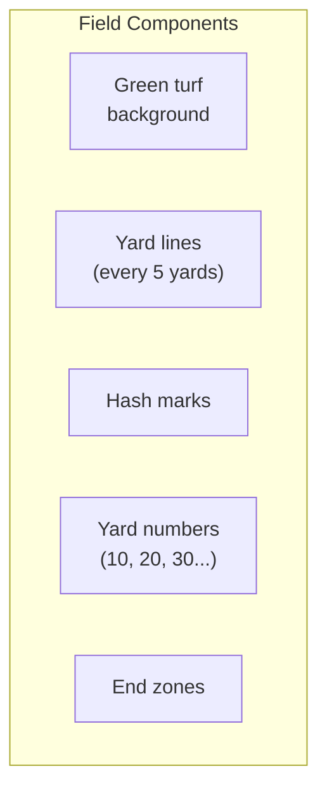
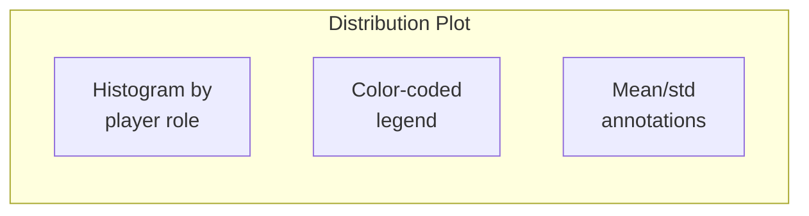
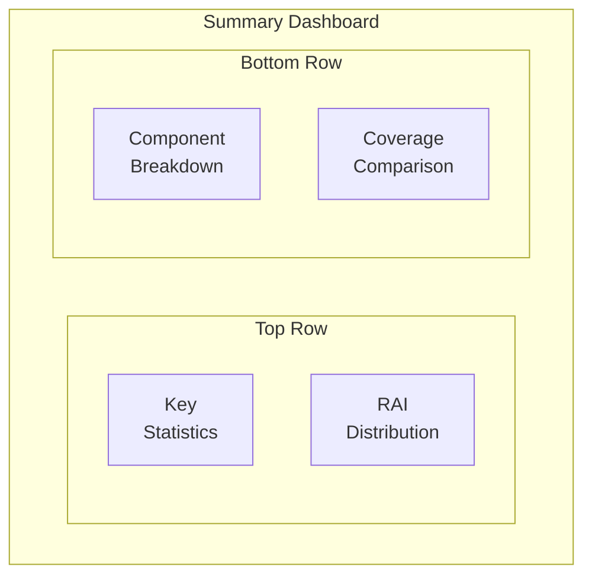

# 📈 Visualizations API Reference

Complete API documentation for the visualization module.

---

## Overview

```python
from nfl_rai.visualizations import RAIVisualizer, NFLFieldPlotter, create_summary_dashboard
```

The visualization module provides publication-quality charts and field plots.

---

## NFLFieldPlotter Class

### Constructor

```python
def __init__(self, figsize: Tuple[int, int] = (14, 7))
```

**Parameters:**

| Parameter | Type | Default | Description |
|-----------|------|---------|-------------|
| `figsize` | `tuple` | `(14, 7)` | Figure size for field plots |

**Color Scheme:**

```python
colors = {
    'field': '#2E7D32',      # Green turf
    'lines': 'white',        # Yard lines
    'offense': '#1565C0',    # Blue for offense
    'defense': '#C62828',    # Red for defense
    'ball': '#FF8F00',       # Orange for ball
    'trajectory': '#7B1FA2', # Purple for trajectories
}
```

---

### `create_field(ax=None, yard_range=(0, 120)) → Axes`

Create a football field visualization.

**Parameters:**

| Parameter | Type | Default | Description |
|-----------|------|---------|-------------|
| `ax` | `Axes` | `None` | Existing axes to draw on, or None to create new |
| `yard_range` | `tuple` | `(0, 120)` | (start, end) yard lines to show |

**Returns:** Matplotlib axes with field drawn

**Example:**

```python
plotter = NFLFieldPlotter()

# Full field
fig, ax = plt.subplots(figsize=(14, 7))
plotter.create_field(ax)

# Partial field (red zone)
plotter.create_field(ax, yard_range=(80, 120))
```

**Field Elements:**



---

### `plot_players(ax, player_data, show_trails=True, frame=None) → Axes`

Plot player positions on the field.

**Parameters:**

| Parameter | Type | Default | Description |
|-----------|------|---------|-------------|
| `ax` | `Axes` | - | Axes with field drawn |
| `player_data` | `DataFrame` | - | DataFrame with x, y, player_side, nfl_id, frame_id |
| `show_trails` | `bool` | `True` | Whether to show movement trails |
| `frame` | `int` | `None` | Specific frame to show, or None for all |

**Returns:** Axes with players plotted

**Example:**

```python
ax = plotter.create_field()
plotter.plot_players(ax, tracking_df, show_trails=True)
plt.show()
```

---

### `plot_trajectories(ax, predicted, actual, nfl_id) → Axes`

Plot predicted vs actual trajectories for a player.

**Parameters:**

| Parameter | Type | Description |
|-----------|------|-------------|
| `ax` | `Axes` | Axes with field |
| `predicted` | `DataFrame` | Predicted trajectory DataFrame |
| `actual` | `DataFrame` | Actual trajectory DataFrame |
| `nfl_id` | `int` | Player to highlight |

**Returns:** Axes with trajectories

**Example:**

```python
ax = plotter.create_field()
plotter.plot_trajectories(ax, pred_df, actual_df, nfl_id=35498001)
plt.legend()
plt.show()
```

---

### `plot_ball_trajectory(ax, start_x, start_y, end_x, end_y)`

Plot ball trajectory from throw to landing.

**Parameters:**

| Parameter | Type | Description |
|-----------|------|-------------|
| `ax` | `Axes` | Axes with field |
| `start_x/y` | `float` | Ball release position |
| `end_x/y` | `float` | Ball landing position |

---

## RAIVisualizer Class

### Constructor

```python
def __init__(self, output_dir: Optional[Path] = None)
```

**Parameters:**

| Parameter | Type | Default | Description |
|-----------|------|---------|-------------|
| `output_dir` | `Path` | `'outputs/figures'` | Directory for saving figures |

---

### `plot_rai_distribution(rai_df, group_by='player_role', save=True) → Figure`

Plot RAI score distribution by group.

**Parameters:**

| Parameter | Type | Default | Description |
|-----------|------|---------|-------------|
| `rai_df` | `DataFrame` | - | DataFrame with RAI scores |
| `group_by` | `str` | `'player_role'` | Column to group by |
| `save` | `bool` | `True` | Whether to save the figure |

**Returns:** Matplotlib figure

**Example:**

```python
viz = RAIVisualizer()
fig = viz.plot_rai_distribution(rai_results, group_by='player_role')
plt.show()
```

**Output:**



---

### `plot_component_breakdown(rai_components, top_n=10, save=True) → Figure`

Plot RAI component breakdown for top players.

**Parameters:**

| Parameter | Type | Default | Description |
|-----------|------|---------|-------------|
| `rai_components` | `DataFrame` | - | DataFrame with all RAI components |
| `top_n` | `int` | `10` | Number of top players to show |
| `save` | `bool` | `True` | Whether to save figure |

**Returns:** Matplotlib figure

**Example:**

```python
fig = viz.plot_component_breakdown(rai_results, top_n=15)
plt.show()
```

---

### `plot_reaction_heatmap(player_data, rai_scores, save=True) → Figure`

Create field heatmap showing reaction quality by position.

**Parameters:**

| Parameter | Type | Default | Description |
|-----------|------|---------|-------------|
| `player_data` | `DataFrame` | - | Tracking data with positions |
| `rai_scores` | `DataFrame` | - | RAI scores for players |
| `save` | `bool` | `True` | Whether to save |

**Returns:** Matplotlib figure

---

### `plot_coverage_comparison(rai_by_coverage, save=True) → Figure`

Compare RAI metrics across coverage types.

**Parameters:**

| Parameter | Type | Default | Description |
|-----------|------|---------|-------------|
| `rai_by_coverage` | `DataFrame` | - | RAI data with coverage_type column |
| `save` | `bool` | `True` | Whether to save |

**Returns:** Matplotlib figure

**Example:**

```python
# Group RAI results by coverage
rai_with_coverage = rai_results.merge(supplementary_df[['gameId', 'playId', 'coverage']])
fig = viz.plot_coverage_comparison(rai_with_coverage)
```

---

### `create_play_animation_frames(...) → List[Figure]`

Create frames for play animation.

**Parameters:**

| Parameter | Type | Description |
|-----------|------|-------------|
| `input_df` | `DataFrame` | Pre-throw tracking |
| `output_df` | `DataFrame` | Post-throw tracking |
| `ball_x/y` | `float` | Ball landing position |
| `rai_scores` | `DataFrame` | Optional RAI scores for coloring |

**Returns:** List of matplotlib figures (one per frame)

---

## `create_summary_dashboard()` Function

```python
def create_summary_dashboard(rai_df: DataFrame, output_path: Path) -> Figure
```

Create a comprehensive summary dashboard.

**Parameters:**

| Parameter | Type | Description |
|-----------|------|-------------|
| `rai_df` | `DataFrame` | Complete RAI analysis results |
| `output_path` | `Path` | Where to save the dashboard |

**Returns:** Dashboard figure

**Example:**

```python
from nfl_rai.visualizations import create_summary_dashboard

fig = create_summary_dashboard(
    rai_df=rai_results,
    output_path=Path('outputs/figures/summary_dashboard.png')
)
```

**Dashboard Layout:**



---

## Complete Usage Example

```python
from nfl_rai.visualizations import RAIVisualizer, NFLFieldPlotter
import matplotlib.pyplot as plt

# Create visualizer
viz = RAIVisualizer(output_dir='my_figures/')

# Plot RAI distribution
fig1 = viz.plot_rai_distribution(rai_results, group_by='player_role')

# Plot component breakdown for top 10 players  
fig2 = viz.plot_component_breakdown(rai_results, top_n=10)

# Plot coverage comparison
fig3 = viz.plot_coverage_comparison(rai_with_coverage)

# Create field plot for specific play
plotter = NFLFieldPlotter()
fig, ax = plt.subplots(figsize=(14, 7))
plotter.create_field(ax)
plotter.plot_players(ax, play_tracking_df)
plotter.plot_ball_trajectory(ax, throw_x, throw_y, land_x, land_y)
plt.title(f"Play {play_id}")
plt.savefig('play_visualization.png')
```

---

## ⏭️ Next

- **[VideoGenerator API](video-generator.md)**
- **[Dashboard Guide](../user-guides/dashboard-guide.md)**
