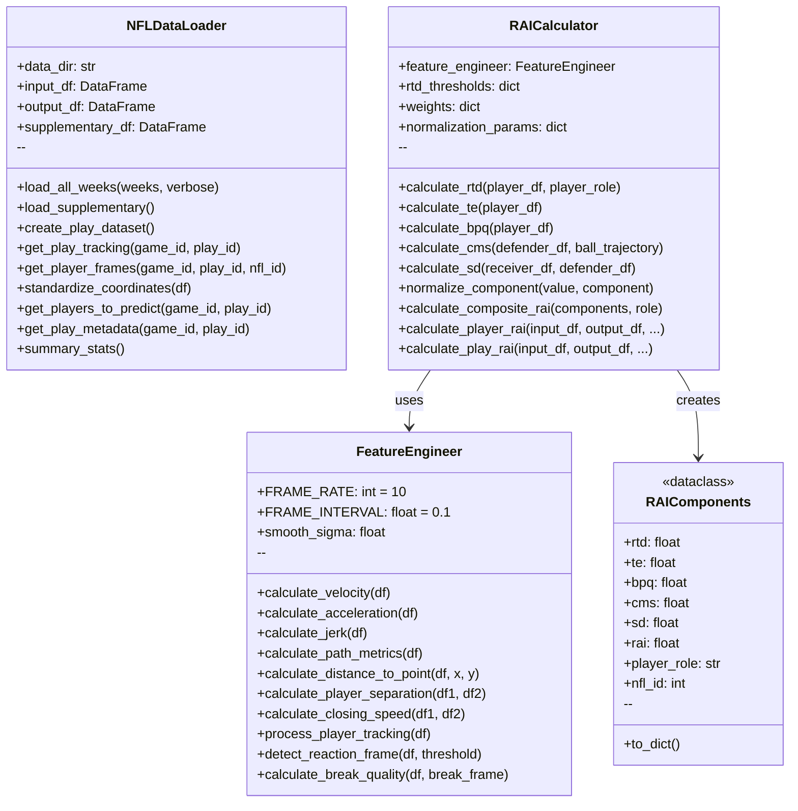
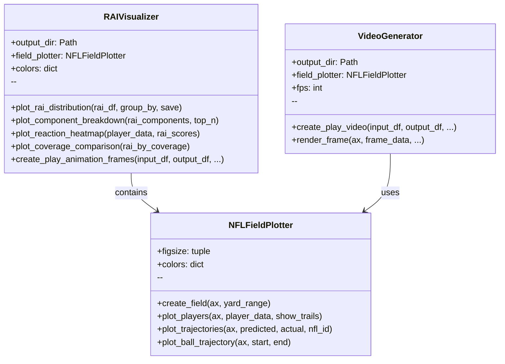
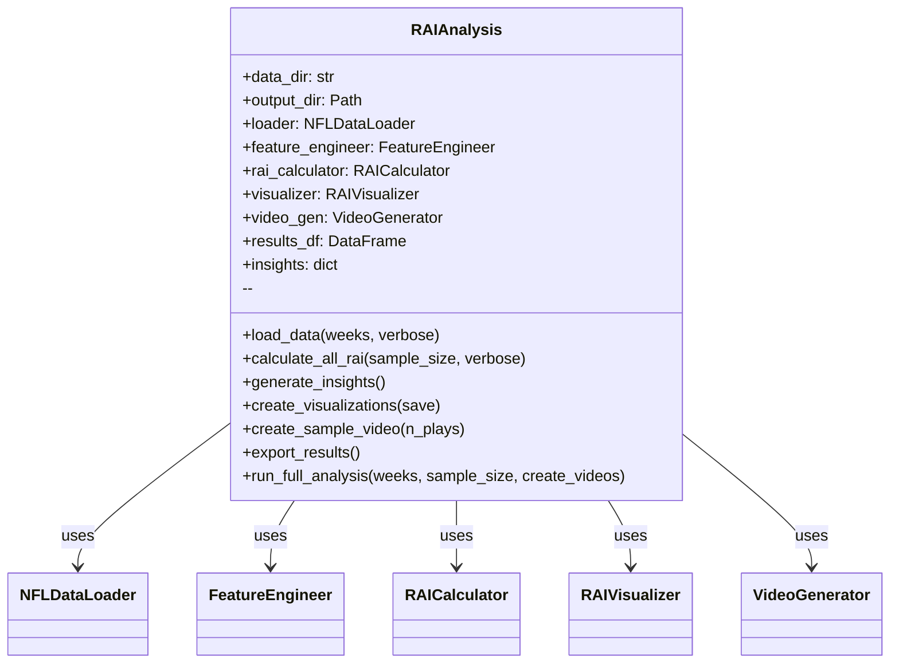
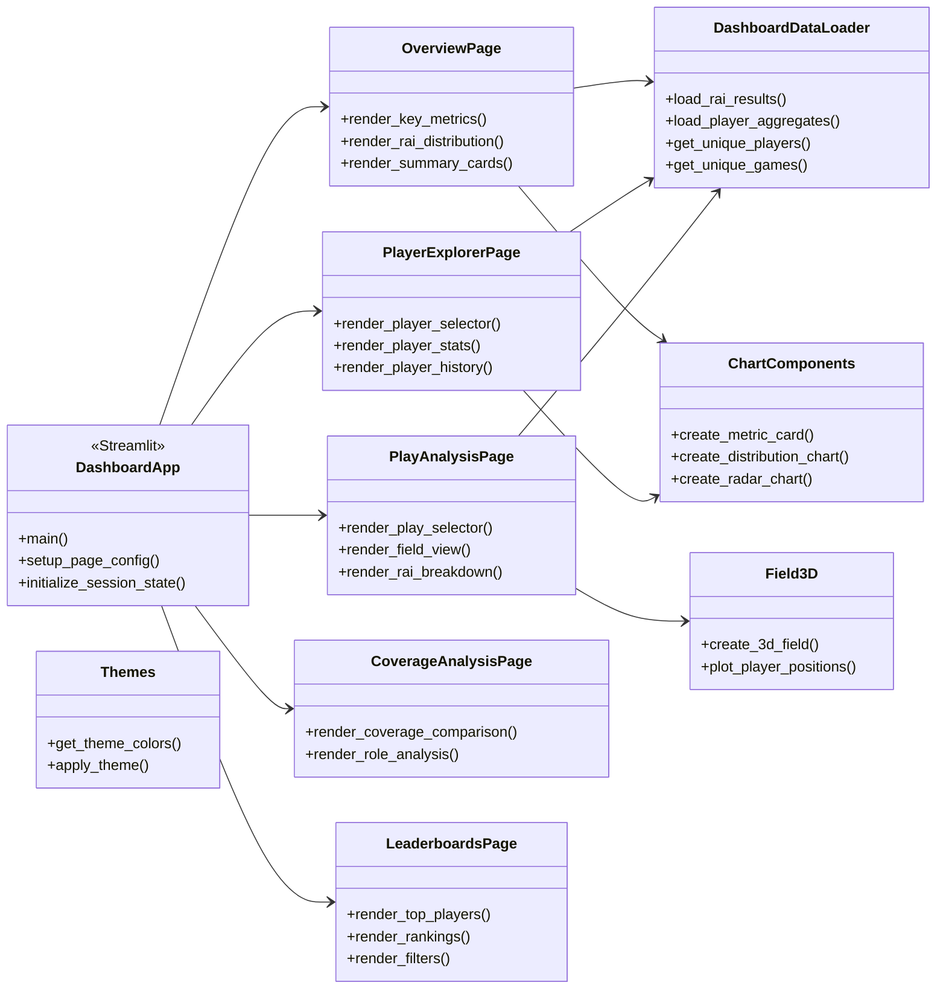
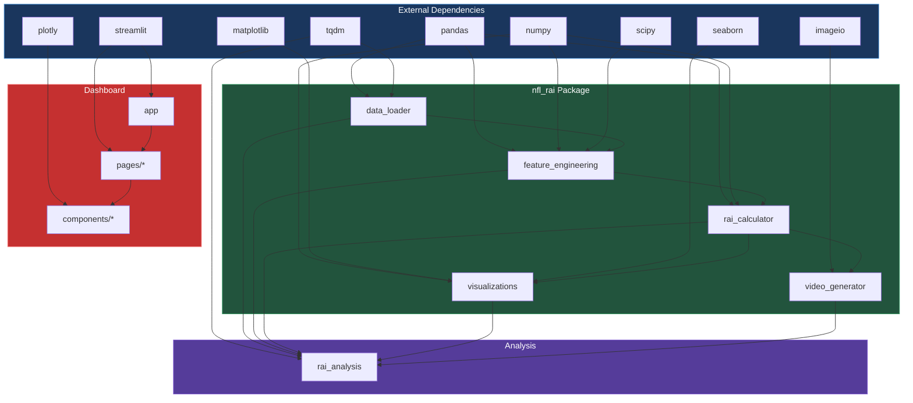
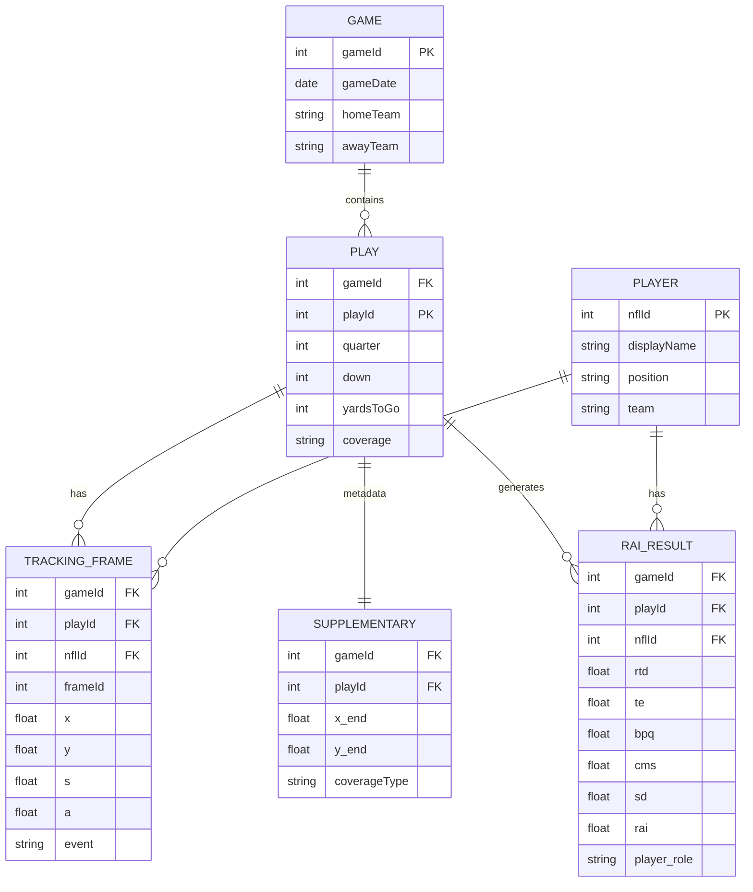
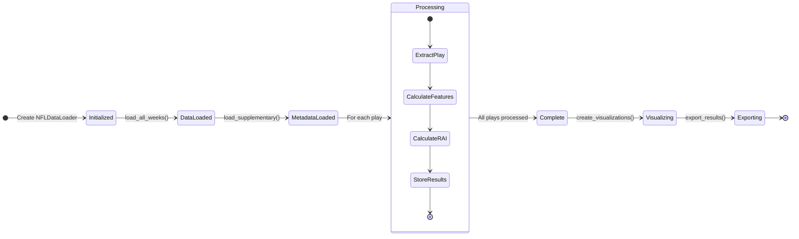

# 🧩 Component Diagram

Class relationships and module dependencies.

---

## 📦 Package Overview

---

## 📊 Visualization Classes

---

## 🔄 Analysis Pipeline

---

## 🖥️ Dashboard Components

---

## 🔗 Module Dependencies

---

## 📐 Entity Relationships

---

## 🔄 State Flow

---

## ⏭️ Next Steps

- **[API Reference](../api-reference/data-loader.md)** - Detailed method documentation
- **[Data Schema](../technical/data-schema.md)** - Column specifications
- **[Dashboard Components](../technical/dashboard-components.md)** - UI architecture
