# 🔄 Data Flow

Detailed data pipeline from raw tracking files to RAI scores.

---

## 📊 Pipeline Overview

```mermaid
flowchart TB
    subgraph input["📥 Input Stage"]
        direction TB
        CSV["📁 tracking_week_*.csv<br/>(18 files, ~50-100MB each)"]
        SUPP["📋 supplementary_data.csv<br/>(7.5MB, play metadata)"]
    end
    
    subgraph load["📂 Loading Stage"]
        direction TB
        L1["Load each week sequentially"]
        L2["Concatenate into single DataFrame"]
        L3["Standardize field orientation"]
        L4["Merge with supplementary data"]
    end
    
    subgraph split["✂️ Split Stage"]
        direction TB
        S1["Identify ball release frame"]
        S2["Split: input_df (pre-throw)"]
        S3["Split: output_df (post-throw)"]
    end
    
    subgraph feature["📐 Feature Stage"]
        direction TB
        F1["Calculate velocity vectors"]
        F2["Calculate acceleration"]
        F3["Calculate jerk (reaction)"]
        F4["Calculate path metrics"]
    end
    
    subgraph rai["🎯 RAI Stage"]
        direction TB
        R1["Calculate RTD, TE, BPQ"]
        R2["Calculate CMS, SD"]
        R3["Apply role weights"]
        R4["Compute composite RAI"]
    end
    
    subgraph output["📊 Output Stage"]
        direction TB
        O1["📈 Figures"]
        O2["📝 CSV Reports"]
        O3["💡 Insights"]
    end
    
    CSV --> L1
    SUPP --> L4
    L1 --> L2 --> L3 --> L4
    L4 --> S1 --> S2 & S3
    S2 & S3 --> F1 --> F2 --> F3 --> F4
    F4 --> R1 --> R2 --> R3 --> R4
    R4 --> O1 & O2 & O3
    
    style input fill:#1a365d,stroke:#3182ce,color:#fff
    style load fill:#2c5282,stroke:#4299e1,color:#fff
    style split fill:#285e61,stroke:#38b2ac,color:#fff
    style feature fill:#22543d,stroke:#38a169,color:#fff
    style rai fill:#553c9a,stroke:#805ad5,color:#fff
    style output fill:#744210,stroke:#d69e2e,color:#fff
```

---

## 📁 Input Data Structure

### Tracking Data Schema

| Column | Type | Description |
|--------|------|-------------|
| `gameId` | int | Unique game identifier |
| `playId` | int | Unique play identifier within game |
| `nflId` | int | Unique player identifier |
| `frameId` | int | Frame number (10Hz = 10 frames/second) |
| `x` | float | X position on field (yards) |
| `y` | float | Y position on field (yards) |
| `s` | float | Speed (yards/second) |
| `a` | float | Acceleration (yards/second²) |
| `dis` | float | Distance traveled since last frame |
| `o` | float | Player orientation (degrees) |
| `dir` | float | Movement direction (degrees) |
| `event` | string | Event type (pass_forward, pass_arrived, etc.) |

### Supplementary Data Schema

| Column | Type | Description |
|--------|------|-------------|
| `gameId` | int | Game identifier |
| `playId` | int | Play identifier |
| `quarter` | int | Game quarter (1-5) |
| `down` | int | Down (1-4) |
| `yardsToGo` | int | Yards to first down |
| `coverage` | string | Coverage type (Cover 1/2/3/etc.) |
| `x_end` | float | Ball landing X position |
| `y_end` | float | Ball landing Y position |

---

## 🔄 Detailed Flow Sequence

```mermaid
sequenceDiagram
    participant Data as 📁 Data Files
    participant Loader as 📂 NFLDataLoader
    participant FE as 📐 FeatureEngineer
    participant Calc as 🎯 RAICalculator
    participant Viz as 📊 Outputs
    
    Note over Data,Viz: Stage 1: Data Loading
    Data->>Loader: tracking_week_1.csv
    Data->>Loader: tracking_week_2.csv
    Data->>Loader: ... (18 weeks)
    Loader->>Loader: Concatenate all weeks
    Data->>Loader: supplementary_data.csv
    Loader->>Loader: Merge on gameId, playId
    
    Note over Data,Viz: Stage 2: Play Extraction
    loop For each unique (gameId, playId)
        Loader->>Loader: Find pass_forward event
        Loader->>Loader: Split into input/output
    end
    
    Note over Data,Viz: Stage 3: Feature Engineering
    loop For each player in play
        Loader->>FE: Player tracking data
        FE->>FE: calculate_velocity()
        FE->>FE: calculate_acceleration()
        FE->>FE: calculate_jerk()
        FE->>FE: calculate_path_metrics()
        FE-->>Calc: Processed features
    end
    
    Note over Data,Viz: Stage 4: RAI Calculation
    loop For each player
        Calc->>Calc: calculate_rtd()
        Calc->>Calc: calculate_te()
        Calc->>Calc: calculate_bpq() / calculate_cms()
        Calc->>Calc: calculate_sd()
        Calc->>Calc: calculate_composite_rai()
    end
    
    Note over Data,Viz: Stage 5: Output Generation
    Calc-->>Viz: RAI DataFrame
    Viz->>Viz: Create visualizations
    Viz->>Viz: Export CSV reports
    Viz->>Viz: Generate insights
```

---

## 📐 Feature Calculation Pipeline

```mermaid
graph LR
    subgraph raw["Raw Data"]
        POS["Position<br/>(x, y)"]
    end
    
    subgraph vel["Velocity"]
        VX["vx = Δx/Δt"]
        VY["vy = Δy/Δt"]
        SPD["speed = √(vx² + vy²)"]
    end
    
    subgraph acc["Acceleration"]
        AX["ax = Δvx/Δt"]
        AY["ay = Δvy/Δt"]
        AMAG["accel = √(ax² + ay²)"]
    end
    
    subgraph jerk["Jerk (Reaction)"]
        JX["jx = Δax/Δt"]
        JY["jy = Δay/Δt"]
        JMAG["jerk = √(jx² + jy²)"]
    end
    
    subgraph path["Path Metrics"]
        PL["path_length"]
        SL["straight_line_dist"]
        TE["efficiency = SL/PL"]
    end
    
    POS --> VX & VY
    VX & VY --> SPD
    VX & VY --> AX & AY
    AX & AY --> AMAG
    AX & AY --> JX & JY
    JX & JY --> JMAG
    POS --> PL & SL
    PL & SL --> TE
    
    style raw fill:#c53030,stroke:#fc8181,color:#fff
    style vel fill:#d69e2e,stroke:#ecc94b,color:#000
    style acc fill:#3182ce,stroke:#63b3ed,color:#fff
    style jerk fill:#553c9a,stroke:#805ad5,color:#fff
    style path fill:#38a169,stroke:#68d391,color:#fff
```

---

## 🎯 RAI Calculation Flow

```mermaid
graph TB
    subgraph features["Processed Features"]
        JERK["Jerk magnitude"]
        PATH["Path efficiency"]
        BREAK["Break angle<br/>& speed retention"]
        BALL["Ball tracking<br/>correlation"]
        SEP["Initial & final<br/>separation"]
    end
    
    subgraph components["RAI Components"]
        RTD["RTD<br/>Reaction Time Delay"]
        TE["TE<br/>Trajectory Efficiency"]
        BPQ["BPQ<br/>Break Point Quality"]
        CMS["CMS<br/>Coverage Maintenance"]
        SD["SD<br/>Separation Delta"]
    end
    
    subgraph weights["Role Weights"]
        DEF["Defender Weights<br/>CMS: +35%<br/>RTD: -25%"]
        REC["Receiver Weights<br/>BPQ: +35%<br/>SD: +25%"]
    end
    
    subgraph final["Final Score"]
        RAI["📊 Composite RAI<br/>Σ(weight × component)"]
    end
    
    JERK --> RTD
    PATH --> TE
    BREAK --> BPQ
    BALL --> CMS
    SEP --> SD
    
    RTD & TE & BPQ & CMS & SD --> DEF & REC
    DEF & REC --> RAI
    
    style features fill:#1a365d,stroke:#3182ce,color:#fff
    style components fill:#22543d,stroke:#38a169,color:#fff
    style weights fill:#553c9a,stroke:#805ad5,color:#fff
    style final fill:#c53030,stroke:#fc8181,color:#fff
```

---

## 📊 Data Volumes at Each Stage

| Stage | Records | Size |
|-------|---------|------|
| **Raw Tracking** | 4,880,579 | ~1.5 GB |
| **Post-throw Only** | 562,936 | ~100 MB |
| **Player-Plays** | 46,045 | ~5 MB |
| **Unique Plays** | 14,108 | Summary |
| **Player Profiles** | 1,178 | Final output |

---

## 💾 Output Artifacts

```mermaid
graph LR
    subgraph results["RAI Results"]
        DF["rai_results.csv<br/>━━━━━━━━━━━━━<br/>46K rows<br/>Per player-play RAI"]
    end
    
    subgraph agg["Aggregated"]
        AGG["player_rai_aggregates.csv<br/>━━━━━━━━━━━━━<br/>1.2K rows<br/>Per player averages"]
    end
    
    subgraph insights["Insights"]
        INS["insights.txt<br/>━━━━━━━━━━━━━<br/>Key findings<br/>Statistical summaries"]
    end
    
    subgraph viz["Visualizations"]
        V1["rai_distribution.png"]
        V2["rai_components.png"]
        V3["coverage_comparison.png"]
        V4["summary_dashboard.png"]
    end
    
    DF --> AGG
    DF --> INS
    DF --> V1 & V2 & V3 & V4
    
    style results fill:#2b6cb0,stroke:#63b3ed,color:#fff
    style agg fill:#38a169,stroke:#68d391,color:#fff
    style insights fill:#d69e2e,stroke:#ecc94b,color:#000
    style viz fill:#553c9a,stroke:#805ad5,color:#fff
```

---

## ⏭️ Next Steps

- **[RAI Methodology](rai-methodology.md)** - The science behind each component
- **[Component Diagram](component-diagram.md)** - Class relationships
- **[Data Schema](../technical/data-schema.md)** - Detailed column specifications
