# 🧪 RAI Methodology

The science behind the Reactivity Advantage Index.

---

## 🎯 Core Concept

The **Reactivity Advantage Index (RAI)** quantifies how well players react during the **ball-in-air window** — the 0.5 to 2.0 seconds after a pass is thrown.


---

## 📊 RAI Formula

```
RAI = w_rtd·RTD + w_te·TE + w_bpq·BPQ + w_cms·CMS + w_sd·SD
```

Where:
- **RTD** = Reaction Time Delay (frames until response)
- **TE** = Trajectory Efficiency (path directness)
- **BPQ** = Break Point Quality (route sharpness)
- **CMS** = Coverage Maintenance Score (ball tracking)
- **SD** = Separation Delta (gap change)

---

## 🔢 Component Details

### 1. Reaction Time Delay (RTD)

**Definition:** Number of frames until significant acceleration/jerk change after ball release.


**Calculation:**
```python
def calculate_rtd(player_df, threshold=5.0, min_frames=2):
    jerk = player_df['jerk_magnitude']
    above_threshold = jerk > threshold
    
    # Find first sustained reaction
    for i, above in enumerate(above_threshold):
        if above and all(above_threshold[i:i+min_frames]):
            return i  # Frame count until reaction
    
    return len(player_df)  # No reaction detected
```

**Interpretation:**
| RTD Value | Meaning |
|-----------|---------|
| 0-2 frames | Elite reaction (instant response) |
| 3-5 frames | Good reaction (typical) |
| 6+ frames | Slow reaction (delayed) |

---

### 2. Trajectory Efficiency (TE)

**Definition:** Ratio of straight-line distance to actual path traveled.

```mermaid
graph TB
    subgraph path["Path Comparison"]
        START["Start Position<br/>(x₀, y₀)"]
        END["End Position<br/>(x_n, y_n)"]
        STRAIGHT["Straight Line<br/>d = √[(x_n-x₀)² + (y_n-y₀)²]"]
        ACTUAL["Actual Path<br/>Σ √[(xᵢ-xᵢ₋₁)² + (yᵢ-yᵢ₋₁)²]"]
    end
    
    subgraph result["Result"]
        TE["TE = Straight / Actual<br/>Range: 0.0 - 1.0"]
    end
    
    START --> STRAIGHT
    END --> STRAIGHT
    START --> ACTUAL
    END --> ACTUAL
    STRAIGHT & ACTUAL --> TE
    
    style path fill:#553c9a,stroke:#805ad5,color:#fff
    style result fill:#38a169,stroke:#68d391,color:#fff
```



**Formula:**
```
TE = straight_line_distance / actual_path_length
```

**Interpretation:**
| TE Value | Meaning |
|----------|---------|
| 0.95-1.0 | Highly efficient (direct path) |
| 0.80-0.95 | Good efficiency (minor deviation) |
| < 0.80 | Inefficient (significant deviation) |

---

### 3. Break Point Quality (BPQ)

**Definition:** Measures route break sharpness × speed retention. **Receivers only.**


**Components:**
- **Angle Sharpness:** How quickly direction changes (sharper = better)
- **Speed Retention:** Percentage of speed maintained through break

**Formula:**
```
BPQ = (angle_sharpness / 90°) × (speed_post / speed_pre)
```

---

### 4. Coverage Maintenance Score (CMS)

**Definition:** Correlation between defender movement direction and ball trajectory. **Defenders only.**

```mermaid
graph TB
    subgraph inputs["Inputs"]
        DDIR["Defender Direction<br/>θ_defender (degrees)"]
        BDIR["Ball Direction<br/>θ_ball (degrees)"]
    end
    
    subgraph calc["Calculation"]
        DIFF["Angular difference<br/>|θ_defender - θ_ball|"]
        NORM["Normalize to [0,1]"]
    end
    
    subgraph result["Result"]
        CMS["CMS = 1 - (diff/180°)<br/>Higher = better tracking"]
    end
    
    DDIR & BDIR --> DIFF --> NORM --> CMS
    
    style inputs fill:#c53030,stroke:#fc8181,color:#fff
    style calc fill:#2b6cb0,stroke:#63b3ed,color:#fff
    style result fill:#38a169,stroke:#68d391,color:#fff
```



**Interpretation:**
| CMS Value | Meaning |
|-----------|---------|
| 0.80-1.0 | Excellent ball tracking |
| 0.60-0.80 | Good awareness |
| < 0.60 | Lost track of ball |

---

### 5. Separation Delta (SD)

**Definition:** Change in receiver-defender separation during ball flight.


**Interpretation:**
| SD Value | Meaning |
|----------|---------|
| > +2 yards | Receiver created significant separation |
| 0 to +2 | Slight separation gain |
| -2 to 0 | Defender maintained/closed |
| < -2 | Tight coverage, pass defense likely |

---

## ⚖️ Role-Specific Weights

Different player roles have different expectations and priorities.


### Weight Tables

| Component | Defenders | Receivers | Pass Rush |
|-----------|-----------|-----------|-----------|
| **RTD** | -0.25 | -0.20 | -0.35 |
| **TE** | +0.20 | +0.15 | +0.35 |
| **BPQ** | +0.05 | +0.35 | +0.10 |
| **CMS** | +0.35 | +0.05 | +0.10 |
| **SD** | +0.15 | +0.25 | +0.10 |

> [!NOTE]
> RTD has negative weight because **lower** reaction time is **better**.

---

## 📈 Statistical Validation

### Distribution by Role

| Role | Mean RAI | Std Dev | Count |
|------|----------|---------|-------|
| **Defensive Coverage** | 0.555 | 0.469 | 31,937 |
| **Targeted Receiver** | 0.523 | 0.225 | 14,108 |

### Key Observations

1. **Defenders show more variance** (0.469 vs 0.225)
   - Reflects reactive nature of coverage
   - More uncertainty in movement

2. **Receivers are more consistent**
   - Execute planned routes
   - Lower variance = scripted movement

3. **Reaction time averages ~2.5 frames (254ms)**
   - Elite performers: < 2 frames (200ms)
   - This is the cognitive processing window

---

## 🧠 Theoretical Foundation

```mermaid
graph TB
    subgraph cognitive["🧠 Cognitive Processing"]
        STIM["Visual stimulus<br/>(ball release)"]
        PROC["Neural processing<br/>(~150-250ms)"]
        DEC["Decision made<br/>(react/hold)"]
    end
    
    subgraph physical["💪 Physical Response"]
        MUS["Muscle activation<br/>(~50ms)"]
        MOV["Movement begins<br/>(measured as RTD)"]
    end
    
    subgraph obs["📊 Observable Metrics"]
        JERK["Jerk increase"]
        ACC["Acceleration change"]
        DIR["Direction change"]
    end
    
    STIM --> PROC --> DEC --> MUS --> MOV
    MOV --> JERK & ACC & DIR
    
    style cognitive fill:#553c9a,stroke:#805ad5,color:#fff
    style physical fill:#38a169,stroke:#68d391,color:#fff
    style obs fill:#d69e2e,stroke:#ecc94b,color:#000
```



---

## 🏈 Coaching Applications

### Player Evaluation


### Component-Specific Training

| Low RTD | Train reaction drills, eye tracking |
|---------|-------------------------------------|
| Low TE | Work on path efficiency, minimize wasted motion |
| Low BPQ | Route technique, break sharpness |
| Low CMS | Ball tracking drills, peripheral vision |

---

## ⏭️ Next Steps

- **[Component Diagram](component-diagram.md)** - Class relationships
- **[RAI Components](../technical/rai-components.md)** - Implementation details
- **[Physics Calculations](../technical/physics-calculations.md)** - Mathematical formulas
