# 🏗️ System Overview

High-level architecture of the NFL RAI Analytics system.

---

## 🎯 System Purpose

The RAI Analytics system **quantifies player reaction quality** during the critical ball-in-air window after a pass is thrown. It transforms raw NFL tracking data into actionable insights for:

- 📊 **Player Evaluation** - Compare reaction capabilities across positions
- 🏈 **Game Planning** - Identify opponent weaknesses
- 🎓 **Training Programs** - Target specific improvement areas
- 📺 **Broadcast Analytics** - Real-time reaction visualization

---

## 🏛️ Architecture Layers

```mermaid
flowchart TB
    subgraph dataLayer["📥 DATA LAYER"]
        direction LR
        T1["Week 1"]
        T2["Week 2"]
        T3["..."]
        T18["Week 18"]
        SUPP["Supplementary<br/>Data"]
    end
    
    subgraph coreLayer["⚙️ CORE PROCESSING LAYER"]
        direction TB
        DL["📂 NFLDataLoader<br/>━━━━━━━━━━━━━<br/>• Load CSV files<br/>• Merge weeks<br/>• Standardize coordinates"]
        
        FE["📐 FeatureEngineer<br/>━━━━━━━━━━━━━<br/>• Velocity vectors<br/>• Acceleration<br/>• Path metrics"]
        
        RC["🎯 RAICalculator<br/>━━━━━━━━━━━━━<br/>• RTD, TE, BPQ<br/>• CMS, SD<br/>• Composite score"]
    end
    
    subgraph outputLayer["📊 OUTPUT LAYER"]
        direction LR
        VIZ["📈 Visualizations"]
        VID["🎬 Videos"]
        REP["📝 Reports"]
        DASH["🖥️ Dashboard"]
    end
    
    T1 --> DL
    T2 --> DL
    T3 --> DL
    T18 --> DL
    SUPP --> DL
    
    DL --> FE
    FE --> RC
    
    RC --> VIZ
    RC --> VID
    RC --> REP
    RC --> DASH
    
    style dataLayer fill:#1a365d,stroke:#3182ce,color:#fff
    style coreLayer fill:#22543d,stroke:#38a169,color:#fff
    style outputLayer fill:#553c9a,stroke:#805ad5,color:#fff
```

---

## 🔄 Processing Pipeline

---

## 🧩 Component Responsibilities

### Data Layer

| Component | Responsibility | Input | Output |
|-----------|---------------|-------|--------|
| **Tracking Data** | Player positions at 10Hz | CSV files | Raw coordinates |
| **Supplementary** | Play context (formations, coverage) | CSV file | Play metadata |

### Core Layer

| Component | Responsibility | Input | Output |
|-----------|---------------|-------|--------|
| **NFLDataLoader** | Load, merge, standardize | CSV files | Unified DataFrame |
| **FeatureEngineer** | Physics calculations | Position data | Velocity, acceleration, jerk |
| **RAICalculator** | Compute RAI scores | Features | Component scores + composite |

### Output Layer

| Component | Responsibility | Input | Output |
|-----------|---------------|-------|--------|
| **RAIVisualizer** | Static plots | RAI scores | PNG figures |
| **VideoGenerator** | Play animations | Tracking data | MP4/GIF videos |
| **Reports** | Data export | RAI scores | CSV files |
| **Dashboard** | Interactive UI | All data | Web application |

---

## 📡 Data Flow Volumes

---

## 🔐 Key Design Principles

### 1. Role-Specific Processing

```mermaid
graph TD
    subgraph players["All Players"]
        P["Player Tracking Data"]
    end
    
    subgraph roles["Role Classification"]
        DEF["🛡️ Defenders<br/>High reactivity weight"]
        REC["🏃 Receivers<br/>High efficiency weight"]
        DL["⚔️ Pass Rush<br/>Physics constrained"]
    end
    
    subgraph weights["Weighted RAI"]
        W1["CMS +35%<br/>RTD -25%"]
        W2["BPQ +35%<br/>SD +25%"]
        W3["TE +35%<br/>RTD -35%"]
    end
    
    P --> DEF & REC & DL
    DEF --> W1
    REC --> W2
    DL --> W3
    
    style DEF fill:#3182ce,stroke:#63b3ed,color:#fff
    style REC fill:#38a169,stroke:#68d391,color:#fff
    style DL fill:#d53f8c,stroke:#f687b3,color:#fff
```

### 2. Temporal Separation

- **Input Data**: Pre-throw state (last frame before ball release)
- **Output Data**: Post-throw tracking (all frames during ball flight)
- **Window**: 0.5 - 2.0 seconds after release

### 3. Physics-Based Features

All derived features are grounded in kinematics:
- Velocity = ∂position/∂time
- Acceleration = ∂velocity/∂time
- Jerk = ∂acceleration/∂time (reaction indicator)

---

## 🛠️ Technology Stack

---

## ⏭️ Next Steps

- **[Data Flow](data-flow.md)** - Detailed data pipeline
- **[RAI Methodology](rai-methodology.md)** - The science behind RAI
- **[Component Diagram](component-diagram.md)** - Class relationships
