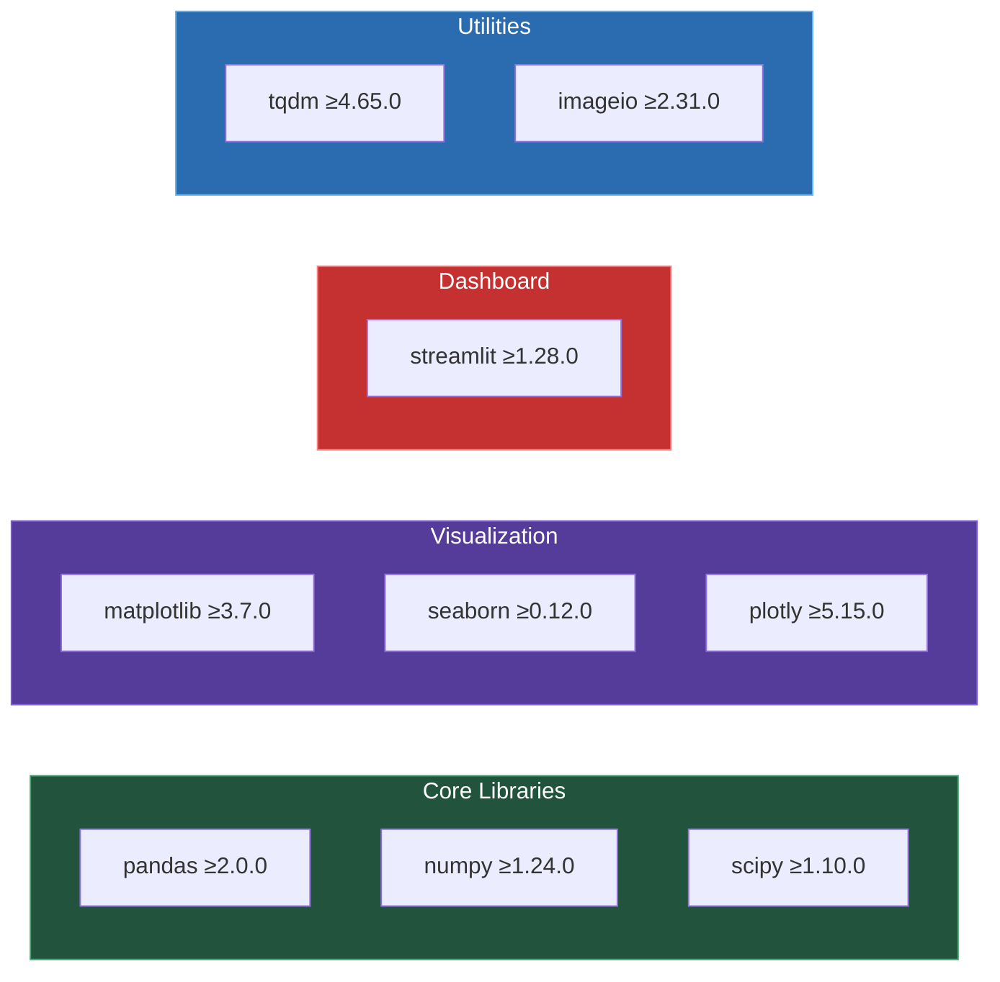

# 📦 Installation Guide

This guide walks you through setting up the NFL RAI Analytics environment on your local machine.

---

## 📋 Prerequisites

| Requirement | Version | Purpose |
|-------------|---------|---------|
| **Python** | 3.8+ | Core runtime |
| **pip** | Latest | Package management |
| **Git** | Any | Version control |

### System Requirements

- **RAM**: Minimum 8GB (16GB recommended for full dataset)
- **Storage**: ~2GB for data and outputs
- **OS**: Linux, macOS, or Windows 10+

---

## 🚀 Installation Steps

### Step 1: Clone the Repository

```bash
git clone <repository-url>
cd analytics-NFL
```

### Step 2: Create Virtual Environment

```bash
# Create virtual environment
python -m venv venv

# Activate (Linux/macOS)
source venv/bin/activate

# Activate (Windows)
venv\Scripts\activate
```

### Step 3: Install Dependencies

```bash
pip install -r requirements.txt
```

### Dependencies Overview



---

## 📂 Data Setup

### Required Data Files

The competition data should be placed in the `train/` directory:

```
train/
├── tracking_week_1.csv
├── tracking_week_2.csv
├── ...
├── tracking_week_18.csv
└── supplementary_data.csv (in root)
```

### Data File Sizes

| File | Approximate Size |
|------|-----------------|
| Each tracking week | ~50-100 MB |
| supplementary_data.csv | ~7.5 MB |
| **Total** | ~1.5 GB |

---

## ✅ Verify Installation

Run the verification script:

```bash
# Test data loading
python -c "from nfl_rai import NFLDataLoader; print('✓ Data loader works')"

# Test feature engineering
python -c "from nfl_rai import FeatureEngineer; print('✓ Feature engineer works')"

# Test RAI calculator
python -c "from nfl_rai import RAICalculator; print('✓ RAI calculator works')"

# Test visualizations
python -c "from nfl_rai.visualizations import RAIVisualizer; print('✓ Visualizations work')"
```

**Expected Output:**
```
✓ Data loader works
✓ Feature engineer works
✓ RAI calculator works
✓ Visualizations work
```

---

## 🖥️ Dashboard Setup

The dashboard requires additional dependencies:

```bash
pip install -r dashboard/requirements_dashboard.txt
```

### Launch Dashboard

```bash
cd dashboard
streamlit run app.py
```

The dashboard will open at `http://localhost:8501`

---

## 🔧 Troubleshooting

### Common Issues

| Issue | Solution |
|-------|----------|
| `ModuleNotFoundError: nfl_rai` | Run from project root directory |
| `FileNotFoundError: tracking_week_*.csv` | Ensure data files are in `train/` |
| Memory errors | Use `--sample 100` flag for testing |
| Dashboard won't start | Check Streamlit installation |

### Need More Help?

See the [Troubleshooting Guide](../reference/troubleshooting.md) for detailed solutions.

---

## ⏭️ Next Steps

Once installation is complete:

1. **[Quick Start Guide](quick-start.md)** - Run your first analysis
2. **[Project Structure](project-structure.md)** - Understand the codebase
3. **[Dashboard Guide](../user-guides/dashboard-guide.md)** - Explore the interactive dashboard
