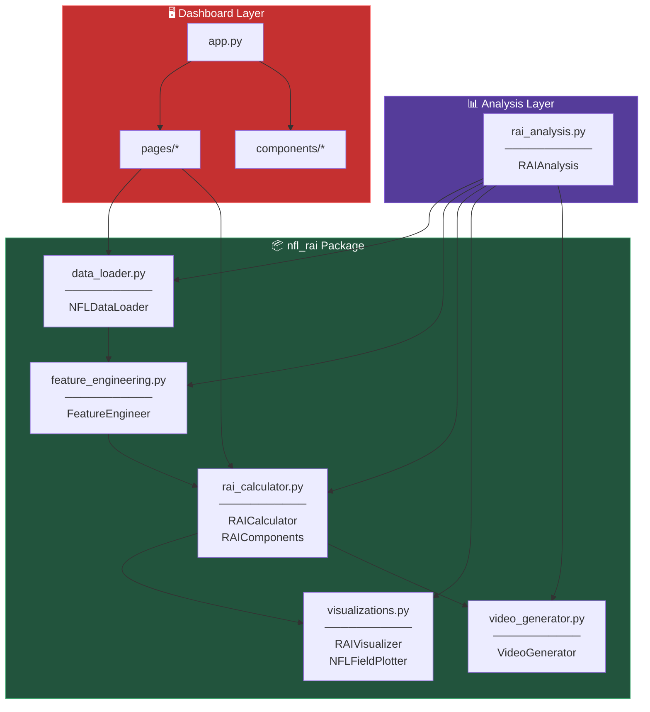
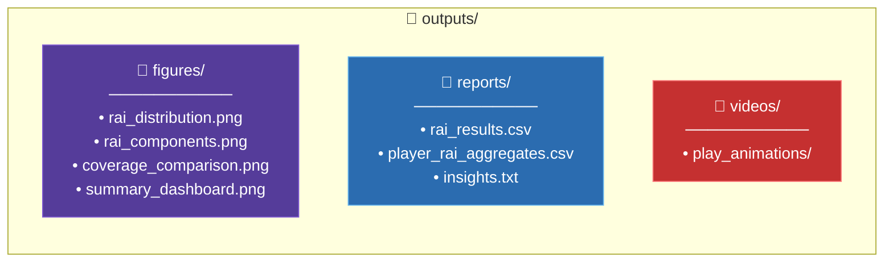

# 📁 Project Structure

Understand how the NFL RAI Analytics codebase is organized.

---

## 🗂️ Directory Overview

```
analytics-NFL/
├── 📂 nfl_rai/                    # Core Python package
│   ├── __init__.py               # Package exports
│   ├── data_loader.py            # Data loading & preprocessing
│   ├── feature_engineering.py    # Physics calculations
│   ├── rai_calculator.py         # RAI metric computation
│   ├── visualizations.py         # Plotting & charting
│   └── video_generator.py        # Animation creation
│
├── 📂 analysis/                   # Analysis scripts
│   └── rai_analysis.py           # Main analysis pipeline
│
├── 📂 dashboard/                  # Interactive dashboard
│   ├── app.py                    # Streamlit entry point
│   ├── 📂 pages/                 # Dashboard pages
│   │   ├── 1_📊_Overview.py
│   │   ├── 2_🏃_Player_Explorer.py
│   │   ├── 3_🏈_Play_Analysis.py
│   │   ├── 4_🛡️_Coverage_Analysis.py
│   │   └── 5_🏆_Leaderboards.py
│   └── 📂 components/            # Reusable UI components
│       ├── charts.py
│       ├── data_loader.py
│       ├── field_3d.py
│       └── themes.py
│
├── 📂 outputs/                    # Generated outputs
│   ├── 📂 figures/               # Static visualizations
│   ├── 📂 reports/               # CSV exports & insights
│   └── 📂 videos/                # Play animations
│
├── 📂 train/                      # Competition data
│   └── tracking_week_*.csv       # 18 weeks of tracking
│
├── 📂 docs/                       # Documentation (you are here!)
│
├── supplementary_data.csv        # Play-level metadata
├── requirements.txt              # Python dependencies
├── README.md                     # Project overview
└── SUBMISSION_WRITEUP.md         # Competition submission
```

---

## 🧩 Module Relationships



---

## 📦 Core Package: `nfl_rai/`

### `data_loader.py`

| Class | Purpose |
|-------|---------|
| `NFLDataLoader` | Load and preprocess tracking data from all 18 weeks |

**Key Methods:**
- `load_all_weeks()` - Load all tracking CSV files
- `load_supplementary()` - Load play metadata
- `get_play_tracking()` - Get input/output frames for a play
- `standardize_coordinates()` - Normalize field orientation

---

### `feature_engineering.py`

| Class | Purpose |
|-------|---------|
| `FeatureEngineer` | Calculate physics-based features from tracking data |

**Key Methods:**
- `calculate_velocity()` - Velocity vectors (vx, vy, speed)
- `calculate_acceleration()` - Acceleration (ax, ay, magnitude)
- `calculate_jerk()` - Rate of acceleration change
- `calculate_path_metrics()` - Path efficiency and curvature
- `detect_reaction_frame()` - Find significant motion change
- `calculate_break_quality()` - Route break sharpness

---

### `rai_calculator.py`

| Class | Purpose |
|-------|---------|
| `RAIComponents` | Dataclass holding all RAI component scores |
| `RAICalculator` | Compute RAI for individual players and plays |

**Key Methods:**
- `calculate_rtd()` - Reaction Time Delay
- `calculate_te()` - Trajectory Efficiency
- `calculate_bpq()` - Break Point Quality
- `calculate_cms()` - Coverage Maintenance Score
- `calculate_sd()` - Separation Delta
- `calculate_composite_rai()` - Weighted composite score
- `calculate_play_rai()` - RAI for all players in a play

---

### `visualizations.py`

| Class | Purpose |
|-------|---------|
| `NFLFieldPlotter` | Draw football field with player positions |
| `RAIVisualizer` | Create RAI-specific charts and dashboards |

**Key Methods:**
- `create_field()` - Draw football field
- `plot_players()` - Plot player positions
- `plot_rai_distribution()` - RAI histogram by role
- `plot_component_breakdown()` - Stacked bar chart
- `plot_coverage_comparison()` - Compare coverage types

---

### `video_generator.py`

| Class | Purpose |
|-------|---------|
| `VideoGenerator` | Create animated play sequences |

**Key Methods:**
- `create_play_video()` - Full play animation
- `render_frame()` - Single frame rendering

---

## 📊 Analysis Layer: `analysis/`

### `rai_analysis.py`

| Class | Purpose |
|-------|---------|
| `RAIAnalysis` | Complete analysis pipeline orchestration |

**Key Methods:**
- `load_data()` - Load all required data
- `calculate_all_rai()` - Process all plays
- `generate_insights()` - Extract key findings
- `create_visualizations()` - Generate all plots
- `export_results()` - Save to CSV/text
- `run_full_analysis()` - Execute complete pipeline

---

## 🖥️ Dashboard Layer: `dashboard/`

### Pages

| Page | Content |
|------|---------|
| `1_📊_Overview.py` | Summary statistics and key metrics |
| `2_🏃_Player_Explorer.py` | Individual player analysis |
| `3_🏈_Play_Analysis.py` | Play-by-play breakdown |
| `4_🛡️_Coverage_Analysis.py` | Coverage type comparison |
| `5_🏆_Leaderboards.py` | Top performers rankings |

### Components

| Component | Purpose |
|-----------|---------|
| `charts.py` | Reusable Plotly chart functions |
| `data_loader.py` | Dashboard-specific data loading |
| `field_3d.py` | 3D field visualizations |
| `themes.py` | Color schemes and styling |

---

## 📁 Output Structure



---

## 🔗 Import Examples

```python
# Core classes
from nfl_rai import NFLDataLoader, FeatureEngineer, RAICalculator

# Visualization
from nfl_rai.visualizations import RAIVisualizer, NFLFieldPlotter

# Video generation
from nfl_rai.video_generator import VideoGenerator

# Analysis pipeline
from analysis.rai_analysis import RAIAnalysis
```

---

## ⏭️ Next Steps

- **[System Overview](../architecture/system-overview.md)** - High-level architecture
- **[API Reference](../api-reference/data-loader.md)** - Detailed API documentation
- **[Running Analysis](../user-guides/running-analysis.md)** - Execute the pipeline
