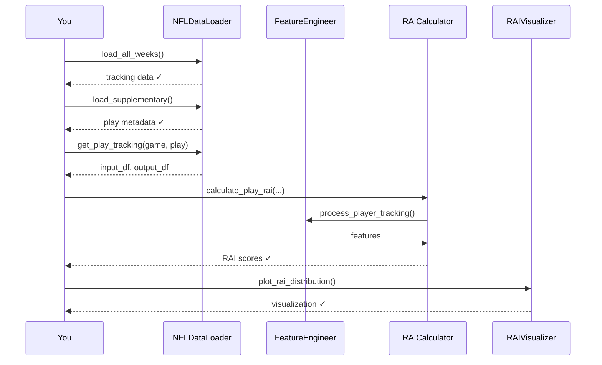

# ⚡ Quick Start Guide

Get RAI analysis running in under 5 minutes!

---

## 🎯 One-Liner to Run Analysis

```bash
python analysis/rai_analysis.py --sample 100 --no-video
```

This runs RAI analysis on 100 sample plays (perfect for testing).

---

## 📊 Step-by-Step Guide

### Step 1: Load Data

```python
from nfl_rai import NFLDataLoader

# Initialize loader
loader = NFLDataLoader()

# Load tracking data (all 18 weeks)
loader.load_all_weeks()

# Load play metadata
loader.load_supplementary()

# Check what we loaded
stats = loader.summary_stats()
print(f"Loaded {stats['total_plays']} plays")
```

**Output:**
```
Loading tracking data: 100%|██████████| 18/18 weeks
Loaded 14,108 plays
```

---

### Step 2: Get Play Data

```python
# Get tracking data for a specific play
game_id = 2023090700  # Example game
play_id = 101         # Example play

input_df, output_df = loader.get_play_tracking(game_id, play_id)

print(f"Input frames: {len(input_df)}")
print(f"Output frames: {len(output_df)}")
```

---

### Step 3: Calculate RAI

```python
from nfl_rai import FeatureEngineer, RAICalculator

# Initialize components
fe = FeatureEngineer()
calc = RAICalculator(fe)

# Get ball landing position from metadata
metadata = loader.get_play_metadata(game_id, play_id)
ball_x = metadata['x_end']
ball_y = metadata['y_end']

# Calculate RAI for all players
rai_results = calc.calculate_play_rai(input_df, output_df, ball_x, ball_y)

# View results
print(rai_results[['nfl_id', 'player_role', 'rai', 'rtd', 'te']].head())
```

**Output:**
```
      nfl_id    player_role    rai    rtd     te
0   35498001    defensive_coverage   0.62   2.0   0.94
1   35492001    defensive_coverage   0.48   3.0   0.91
2   35501001    targeted_receiver    0.55   2.0   0.97
...
```

---

### Step 4: Visualize Results

```python
from nfl_rai.visualizations import RAIVisualizer

# Initialize visualizer
viz = RAIVisualizer()

# Plot RAI distribution
viz.plot_rai_distribution(rai_results)

# Plot component breakdown
viz.plot_component_breakdown(rai_results)
```

---

## 🔄 Complete Workflow Diagram



---

## 🚀 Full Analysis Pipeline

For a complete analysis of all plays:

```python
from analysis.rai_analysis import RAIAnalysis

# Initialize pipeline
analysis = RAIAnalysis()

# Run full analysis
analysis.run_full_analysis(
    weeks=None,        # All weeks (or specify [1,2,3])
    sample_size=None,  # All plays (or specify number)
    create_videos=True # Generate animations
)
```

This will:
1. ✅ Load all tracking data
2. ✅ Calculate RAI for every play
3. ✅ Generate insights
4. ✅ Create visualizations
5. ✅ Export reports to `outputs/`

---

## 📁 Output Files

After running analysis, check these directories:

```
outputs/
├── figures/
│   ├── rai_distribution.png
│   ├── rai_components.png
│   ├── coverage_comparison.png
│   └── summary_dashboard.png
├── reports/
│   ├── rai_results.csv
│   ├── player_rai_aggregates.csv
│   └── insights.txt
└── videos/
    └── play_animations/
```

---

## 💡 Quick Tips

> [!TIP]
> **Testing Mode**: Use `--sample 100` for quick testing

> [!TIP]
> **Skip Videos**: Add `--no-video` flag to speed up analysis

> [!TIP]
> **Specific Weeks**: Use `--weeks 1 2 3` to analyze only certain weeks

---

## ⏭️ Next Steps

- **[Project Structure](project-structure.md)** - Understand the codebase
- **[Running Analysis](../user-guides/running-analysis.md)** - Full command-line options
- **[Dashboard Guide](../user-guides/dashboard-guide.md)** - Interactive exploration
