# 🏈 NFL Big Data Bowl 2026 - RAI Analytics Documentation

> **Reactivity Advantage Index (RAI)** - A novel metric measuring how players cognitively and physically react during the critical ball-in-air window after a pass is thrown.

---

## 📊 Key Statistics

| Metric | Value |
|--------|-------|
| **Total Plays Analyzed** | 14,108 |
| **Player-Plays** | 46,045 |
| **Unique Players** | 1,178 |
| **Average RAI Score** | 0.545 |
| **Average Reaction Time** | 254ms |

---

## 🏗️ System Architecture

```mermaid
flowchart TB
    subgraph input["📥 Data Input"]
        TD["🏈 Tracking Data<br/>(18 weeks, 10Hz)"]
        SD["📋 Supplementary Data<br/>(Play metadata)"]
    end
    
    subgraph core["⚙️ RAI Core Engine"]
        DL["📂 NFLDataLoader<br/>Load & preprocess"]
        FE["📐 FeatureEngineer<br/>Physics calculations"]
        RC["🎯 RAICalculator<br/>Composite scoring"]
    end
    
    subgraph output["📊 Output Layer"]
        VIZ["📈 Visualizations"]
        VID["🎬 Video Generator"]
        DASH["🖥️ Dashboard"]
        REP["📝 Reports"]
    end
    
    TD --> DL
    SD --> DL
    DL --> FE
    FE --> RC
    RC --> VIZ
    RC --> VID
    RC --> DASH
    RC --> REP
    
    style input fill:#1a365d,stroke:#3182ce,color:#fff
    style core fill:#22543d,stroke:#38a169,color:#fff
    style output fill:#553c9a,stroke:#805ad5,color:#fff
```



---

## 📚 Documentation Sections

### 🚀 Getting Started
- [Installation Guide](getting-started/installation.md) - Set up your environment
- [Quick Start](getting-started/quick-start.md) - Run your first analysis in 5 minutes
- [Project Structure](getting-started/project-structure.md) - Understand the codebase

### 🏛️ Architecture
- [System Overview](architecture/system-overview.md) - High-level architecture
- [Data Flow](architecture/data-flow.md) - How data moves through the system
- [RAI Methodology](architecture/rai-methodology.md) - The science behind RAI
- [Component Diagram](architecture/component-diagram.md) - Module relationships

### 📖 API Reference
- [NFLDataLoader](api-reference/data-loader.md) - Data loading and preprocessing
- [FeatureEngineer](api-reference/feature-engineering.md) - Physics calculations
- [RAICalculator](api-reference/rai-calculator.md) - Core RAI computation
- [Visualizations](api-reference/visualizations.md) - Plotting and charting
- [VideoGenerator](api-reference/video-generator.md) - Animation creation

### 👤 User Guides
- [Dashboard Guide](user-guides/dashboard-guide.md) - Interactive dashboard walkthrough
- [Running Analysis](user-guides/running-analysis.md) - Execute RAI analysis
- [Interpreting Results](user-guides/interpreting-results.md) - Understand RAI scores
- [Coaching Applications](user-guides/coaching-applications.md) - NFL team use cases

### 🔧 Technical Documentation
- [Data Schema](technical/data-schema.md) - Data format specifications
- [RAI Components](technical/rai-components.md) - RTD, TE, BPQ, CMS, SD explained
- [Physics Calculations](technical/physics-calculations.md) - Mathematical foundations
- [Dashboard Components](technical/dashboard-components.md) - Streamlit architecture

### 📋 Reference
- [Configuration](reference/configuration.md) - Customization options
- [Troubleshooting](reference/troubleshooting.md) - Common issues & solutions
- [FAQ](reference/faq.md) - Frequently asked questions

---

## 🎯 RAI Components at a Glance


---

## 💡 Quick Formula

```
RAI = w_rtd·RTD + w_te·TE + w_bpq·BPQ + w_cms·CMS + w_sd·SD
```

**Role-Specific Weights:**

| Role | RTD | TE | BPQ | CMS | SD |
|------|-----|----|----|-----|-----|
| **Defenders** | -0.25 | +0.20 | +0.05 | +0.35 | +0.15 |
| **Receivers** | -0.20 | +0.15 | +0.35 | +0.05 | +0.25 |
| **Pass Rush** | -0.35 | +0.35 | +0.10 | +0.10 | +0.10 |

---

## 🏃 Quick Start

```bash
# Install dependencies
pip install -r requirements.txt

# Run full analysis
python analysis/rai_analysis.py

# Launch dashboard
cd dashboard && streamlit run app.py
```

---

## 📞 Support

For questions about this project, refer to:
- [Troubleshooting Guide](reference/troubleshooting.md)
- [FAQ](reference/faq.md)
- [NFL Big Data Bowl Competition Page](https://www.kaggle.com/competitions/nfl-big-data-bowl-2026)
