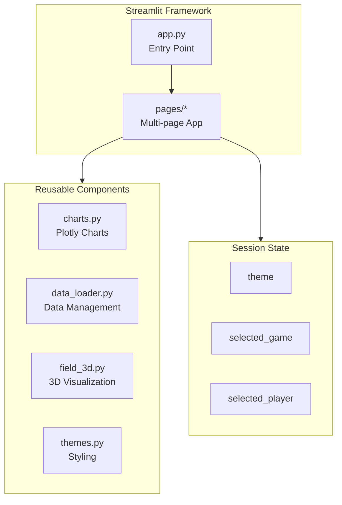
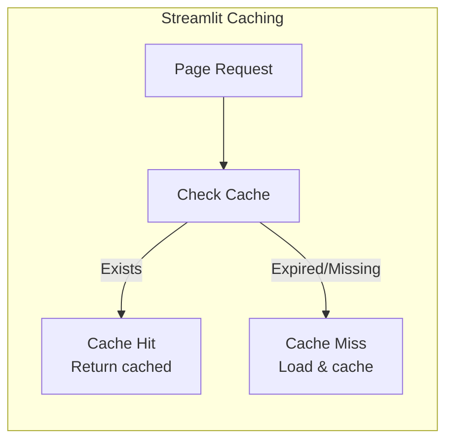
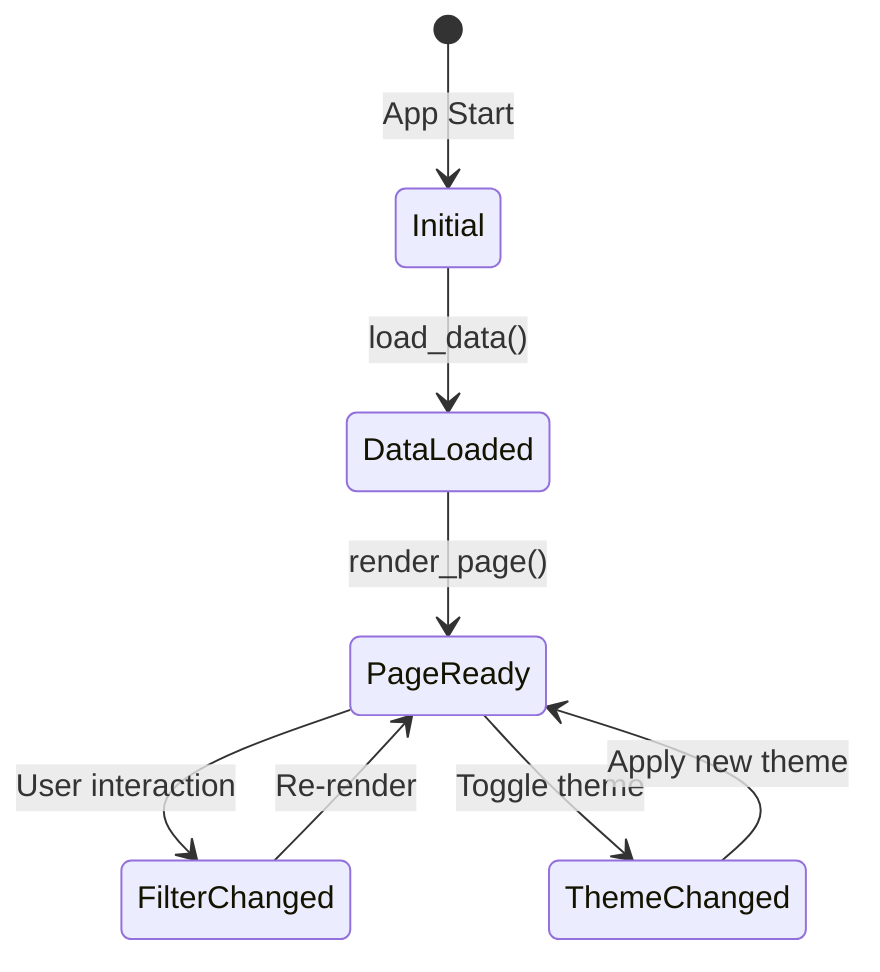

# 🖥️ Dashboard Components

Technical documentation for the Streamlit dashboard architecture.

---

## 📁 Dashboard Structure

```
dashboard/
├── app.py                    # Main entry point
├── requirements_dashboard.txt
├── .streamlit/
│   └── config.toml          # Streamlit configuration
├── pages/
│   ├── 1_📊_Overview.py
│   ├── 2_🏃_Player_Explorer.py
│   ├── 3_🏈_Play_Analysis.py
│   ├── 4_🛡️_Coverage_Analysis.py
│   └── 5_🏆_Leaderboards.py
└── components/
    ├── __init__.py
    ├── charts.py
    ├── data_loader.py
    ├── field_3d.py
    └── themes.py
```

---

## 🏗️ Architecture



---

## 📄 Main App (`app.py`)

### Entry Point

```python
import streamlit as st

def main():
    # Page configuration
    st.set_page_config(
        page_title="NFL RAI Dashboard",
        page_icon="🏈",
        layout="wide",
        initial_sidebar_state="expanded"
    )
    
    # Initialize session state
    if 'theme' not in st.session_state:
        st.session_state.theme = 'dark'
    
    # Render sidebar
    render_sidebar()
    
    # Main content
    render_home_page()

if __name__ == "__main__":
    main()
```

### Session State Variables

| Variable | Type | Purpose |
|----------|------|---------|
| `theme` | str | 'light' or 'dark' |
| `selected_game` | int | Active gameId |
| `selected_player` | int | Active nflId |
| `data_loaded` | bool | Data loading status |

---

## 📊 Charts Component

### `charts.py`

Reusable Plotly chart functions.

```python
def create_metric_card(title, value, delta=None, icon=None):
    """Create a styled metric card."""
    
def create_distribution_chart(df, column, group_by=None):
    """Create histogram/distribution chart."""
    
def create_radar_chart(player_data, components):
    """Create radar chart for player components."""
    
def create_comparison_bar(df, metric, group_col):
    """Create grouped bar chart for comparisons."""
```

### Example Usage

```python
from components.charts import create_radar_chart

# Player component radar
fig = create_radar_chart(
    player_data={'RTD': 0.8, 'TE': 0.9, 'BPQ': 0.7, 'CMS': 0.85, 'SD': 0.6},
    components=['RTD', 'TE', 'BPQ', 'CMS', 'SD']
)
st.plotly_chart(fig)
```

---

## 📂 Data Loader Component

### `data_loader.py`

Dashboard-specific data loading with caching.

```python
@st.cache_data(ttl=3600)  # Cache for 1 hour
def load_rai_results():
    """Load RAI results with caching."""
    return pd.read_csv('outputs/reports/rai_results.csv')

@st.cache_data(ttl=3600)
def load_player_aggregates():
    """Load player aggregates with caching."""
    return pd.read_csv('outputs/reports/player_rai_aggregates.csv')

def get_unique_players(df):
    """Get list of unique players for selection."""
    
def get_unique_games(df):
    """Get list of unique games for selection."""
```

### Caching Strategy



---

## 🏈 3D Field Component

### `field_3d.py`

Interactive 3D field visualization.

```python
def create_3d_field(yard_range=(0, 100)):
    """Create 3D football field mesh."""
    
def plot_player_positions(fig, positions, colors):
    """Add player markers to 3D field."""
    
def animate_play(frames, fps=10):
    """Create animated play visualization."""
```

### 3D Visualization Features

| Feature | Description |
|---------|-------------|
| Field mesh | Green turf with yard lines |
| Player markers | 3D spheres with team colors |
| Ball trajectory | Animated arc |
| Camera controls | Rotate, zoom, pan |

---

## 🎨 Themes Component

### `themes.py`

Color schemes and styling.

```python
THEMES = {
    'dark': {
        'bg_primary': '#0E1117',
        'bg_secondary': '#1A1D21',
        'text_primary': '#FFFFFF',
        'text_secondary': '#B2B2B2',
        'accent': '#FF4B4B',
        'offense': '#1E88E5',
        'defense': '#D32F2F',
    },
    'light': {
        'bg_primary': '#FFFFFF',
        'bg_secondary': '#F0F2F6',
        'text_primary': '#262730',
        'text_secondary': '#6B6B6B',
        'accent': '#FF4B4B',
        'offense': '#1976D2',
        'defense': '#C62828',
    }
}

def get_theme_colors():
    """Get colors for current theme."""
    return THEMES[st.session_state.theme]

def apply_theme():
    """Apply CSS styling for current theme."""
```

---

## 📱 Page Components

### Page Template Pattern

Each page follows this pattern:

```python
import streamlit as st
from components.data_loader import load_rai_results
from components.charts import create_distribution_chart
from components.themes import get_theme_colors

def render_page():
    st.title("📊 Page Title")
    
    # Load data
    df = load_rai_results()
    colors = get_theme_colors()
    
    # Sidebar filters
    with st.sidebar:
        selected_filter = st.selectbox("Filter", options)
    
    # Main content
    col1, col2 = st.columns(2)
    
    with col1:
        st.subheader("Chart 1")
        fig = create_chart(df)
        st.plotly_chart(fig)
    
    with col2:
        st.subheader("Chart 2")
        # ...

if __name__ == "__page__":
    render_page()
```

---

## 🔄 State Management



---

## 📦 Dependencies

```txt
# requirements_dashboard.txt
streamlit>=1.28.0
plotly>=5.15.0
pandas>=2.0.0
numpy>=1.24.0
```

---

## ⏭️ Next

- **[Dashboard Guide](../user-guides/dashboard-guide.md)** - User walkthrough
- **[Configuration](../reference/configuration.md)** - Customization options
