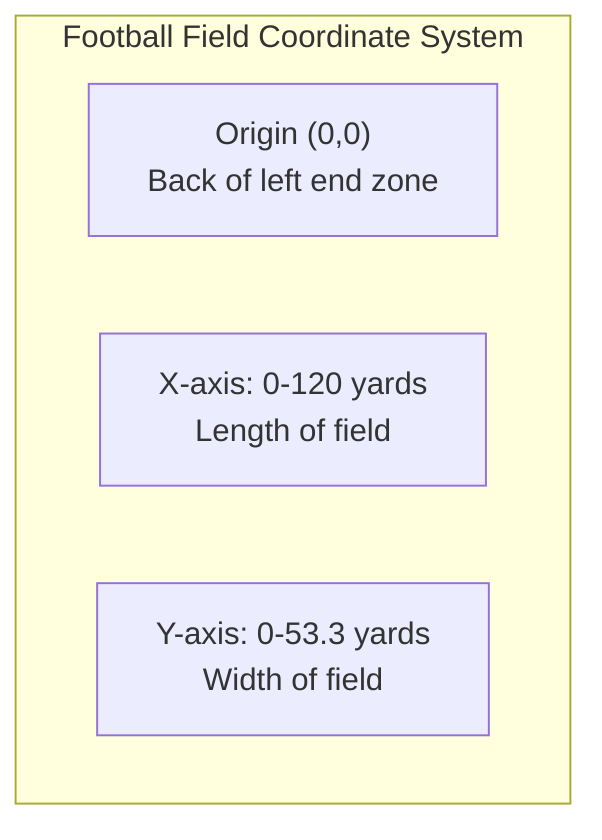
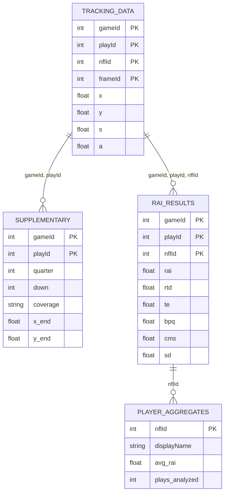

# 📋 Data Schema Reference

Complete data format specifications for NFL RAI Analytics.

---

## 📥 Input Data Schemas

### Tracking Data (`tracking_week_*.csv`)

18 CSV files, one per week.

| Column | Type | Description | Example |
|--------|------|-------------|---------|
| `gameId` | int64 | Unique game identifier | 2023090700 |
| `playId` | int64 | Play identifier within game | 101 |
| `nflId` | int64 | Unique player identifier | 35498001 |
| `displayName` | string | Player display name | "Patrick Mahomes" |
| `frameId` | int64 | Frame number (10Hz sampling) | 15 |
| `time` | datetime | Timestamp | 2023-09-07 20:15:03.1 |
| `jerseyNumber` | int | Player jersey number | 15 |
| `club` | string | Team abbreviation | "KC" |
| `playDirection` | string | Play direction | "left" / "right" |
| `x` | float64 | X position (yards, 0-120) | 45.32 |
| `y` | float64 | Y position (yards, 0-53.3) | 22.18 |
| `s` | float64 | Speed (yards/second) | 4.82 |
| `a` | float64 | Acceleration (yards/sec²) | 2.15 |
| `dis` | float64 | Distance since last frame | 0.48 |
| `o` | float64 | Player orientation (degrees) | 125.5 |
| `dir` | float64 | Movement direction (degrees) | 118.2 |
| `event` | string | Event at this frame | "pass_forward" |

**Event Types:**

| Event | Description |
|-------|-------------|
| `ball_snap` | Ball is snapped |
| `pass_forward` | Ball is thrown |
| `pass_arrived` | Ball reaches target |
| `pass_outcome_caught` | Pass completed |
| `pass_outcome_incomplete` | Pass incomplete |
| `tackle` | Ball carrier tackled |

---

### Supplementary Data (`supplementary_data.csv`)

Play-level metadata.

| Column | Type | Description | Example |
|--------|------|-------------|---------|
| `gameId` | int64 | Game identifier | 2023090700 |
| `playId` | int64 | Play identifier | 101 |
| `quarter` | int | Game quarter (1-5 for OT) | 2 |
| `down` | int | Down (1-4) | 3 |
| `yardsToGo` | int | Yards for first down | 7 |
| `possessionTeam` | string | Team with ball | "KC" |
| `defensiveTeam` | string | Defending team | "DET" |
| `yardlineNumber` | int | Yard line | 35 |
| `yardlineSide` | string | Side of field | "KC" |
| `gameClock` | string | Time remaining | "12:45" |
| `preSnapHomeScore` | int | Home team score | 14 |
| `preSnapVisitorScore` | int | Visitor score | 10 |
| `playResult` | int | Yards gained/lost | 12 |
| `passResult` | string | Pass outcome | "C" (Complete) |
| `coverage` | string | Defensive coverage | "Cover 3" |
| `x_end` | float64 | Ball landing X | 47.82 |
| `y_end` | float64 | Ball landing Y | 18.35 |

---

## 📤 Output Data Schemas

### RAI Results (`rai_results.csv`)

Per player-play RAI scores.

| Column | Type | Description | Range |
|--------|------|-------------|-------|
| `gameId` | int64 | Game identifier | - |
| `playId` | int64 | Play identifier | - |
| `nflId` | int64 | Player identifier | - |
| `displayName` | string | Player name | - |
| `position` | string | Player position | "CB", "WR", etc. |
| `team` | string | Team abbreviation | - |
| `player_role` | string | Role classification | "defensive_coverage", "targeted_receiver" |
| `rtd` | float64 | Reaction Time Delay | 0-20 frames |
| `te` | float64 | Trajectory Efficiency | 0.0-1.0 |
| `bpq` | float64 | Break Point Quality | 0.0-1.0 |
| `cms` | float64 | Coverage Maintenance | 0.0-1.0 |
| `sd` | float64 | Separation Delta | -10 to +10 yards |
| `rai` | float64 | Composite RAI Score | -2.0 to +2.0 |

---

### Player Aggregates (`player_rai_aggregates.csv`)

Aggregated per-player statistics.

| Column | Type | Description |
|--------|------|-------------|
| `nflId` | int64 | Player identifier |
| `displayName` | string | Player name |
| `position` | string | Position |
| `team` | string | Team |
| `plays_analyzed` | int | Number of plays |
| `avg_rai` | float64 | Mean RAI score |
| `std_rai` | float64 | RAI standard deviation |
| `avg_rtd` | float64 | Mean reaction time |
| `avg_te` | float64 | Mean efficiency |
| `avg_bpq` | float64 | Mean break quality |
| `avg_cms` | float64 | Mean coverage |
| `avg_sd` | float64 | Mean separation |
| `min_rai` | float64 | Minimum RAI |
| `max_rai` | float64 | Maximum RAI |

---

## 📐 Coordinate System

| Axis | Range | Direction |
|------|-------|-----------|
| **X** | 0-120 yards | End zone to end zone |
| **Y** | 0-53.3 yards | Sideline to sideline |

**Field Landmarks:**

| Location | X Value |
|----------|---------|
| Left end zone back | 0 |
| Left goal line | 10 |
| 50-yard line | 60 |
| Right goal line | 110 |
| Right end zone back | 120 |

---

## 🔄 Data Relationships

---

## 📊 Data Volumes

| Dataset | Records | Size |
|---------|---------|------|
| Tracking (all weeks) | ~4.9M | ~1.5 GB |
| Supplementary | ~18K | ~7.5 MB |
| RAI Results | ~46K | ~5 MB |
| Player Aggregates | ~1.2K | ~80 KB |

---

## ⏭️ Next

- **[RAI Components](rai-components.md)** - Component details
- **[API Reference](../api-reference/data-loader.md)** - Loading data
