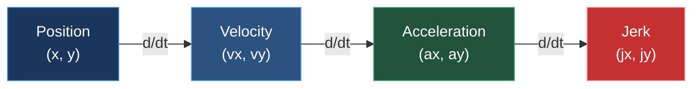
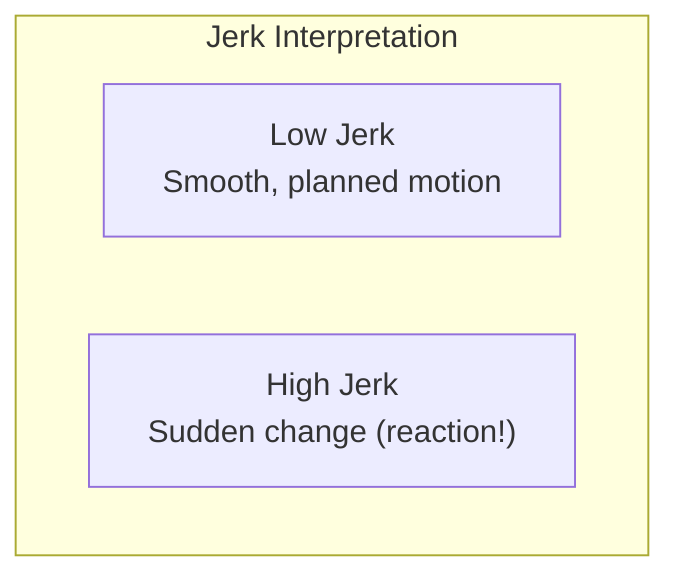

# 📐 Physics Calculations

Mathematical foundations for feature engineering.

---

## 🔬 Kinematic Chain

All derived features follow the kinematic chain:



---

## 📍 Position Data

**Source:** Raw tracking data provides (x, y) coordinates at 10 Hz.

| Parameter | Value |
|-----------|-------|
| Sample Rate | 10 Hz |
| Frame Interval (Δt) | 0.1 seconds (100 ms) |
| Coordinate System | Yards |

---

## ⚡ Velocity Calculations

### Vector Components

```
vx = (x[t] - x[t-1]) / Δt
vy = (y[t] - y[t-1]) / Δt
```

### Speed (Magnitude)

```
speed = √(vx² + vy²)
```

### Direction (Angle)

```
direction = arctan2(vy, vx) × (180° / π)
```

**Range:** -180° to +180° (or 0° to 360°)

### Code Implementation

```python
def calculate_velocity(df, frame_interval=0.1):
    # Component velocities
    df['vx'] = df['x'].diff() / frame_interval
    df['vy'] = df['y'].diff() / frame_interval
    
    # Apply Gaussian smoothing
    df['vx'] = gaussian_filter1d(df['vx'].fillna(0), sigma=1.0)
    df['vy'] = gaussian_filter1d(df['vy'].fillna(0), sigma=1.0)
    
    # Magnitude
    df['speed'] = np.sqrt(df['vx']**2 + df['vy']**2)
    
    # Direction
    df['direction_calc'] = np.arctan2(df['vy'], df['vx']) * (180 / np.pi)
    
    return df
```

---

## 🚀 Acceleration Calculations

### Vector Components

```
ax = (vx[t] - vx[t-1]) / Δt = Δvx / Δt
ay = (vy[t] - vy[t-1]) / Δt = Δvy / Δt
```

### Magnitude

```
acceleration = √(ax² + ay²)
```

### Units

- Velocity: yards/second
- Acceleration: yards/second²

### Code Implementation

```python
def calculate_acceleration(df, frame_interval=0.1):
    df['ax'] = df['vx'].diff() / frame_interval
    df['ay'] = df['vy'].diff() / frame_interval
    
    # Apply smoothing
    df['ax'] = gaussian_filter1d(df['ax'].fillna(0), sigma=1.0)
    df['ay'] = gaussian_filter1d(df['ay'].fillna(0), sigma=1.0)
    
    df['accel_magnitude'] = np.sqrt(df['ax']**2 + df['ay']**2)
    
    return df
```

---

## 📈 Jerk Calculations

### Definition

**Jerk = rate of change of acceleration** (key reaction indicator)

### Formula

```
jx = (ax[t] - ax[t-1]) / Δt = Δax / Δt
jy = (ay[t] - ay[t-1]) / Δt = Δay / Δt
jerk = √(jx² + jy²)
```

### Units

- Jerk: yards/second³

### Physical Meaning



| Jerk Value | Interpretation |
|------------|----------------|
| < 3 | Smooth, continuous motion |
| 3-5 | Minor adjustment |
| 5-10 | Significant direction change |
| > 10 | Sharp reaction/response |

---

## 📏 Path Metrics

### Path Length

```
path_length = Σ √[(x[i] - x[i-1])² + (y[i] - y[i-1])²]
           = Σ (distance between consecutive points)
```

### Straight-Line Distance

```
straight_line = √[(x[end] - x[start])² + (y[end] - y[start])²]
```

### Path Efficiency

```
efficiency = straight_line / path_length
```

**Range:** 0 to 1 (1 = perfectly straight)

### Curvature

Local curvature at each point:

```
κ = |vx × ay - vy × ax| / (vx² + vy²)^(3/2)
```

Where:
- vx, vy = velocity components
- ax, ay = acceleration components

---

## 📐 Distance Calculations

### Euclidean Distance

Between player at (x₁, y₁) and target at (x₂, y₂):

```
distance = √[(x₂ - x₁)² + (y₂ - y₁)²]
```

### Closing Speed

Rate at which distance changes:

```
closing_speed = -d(distance)/dt
```

- **Positive**: Players getting closer
- **Negative**: Players separating

---

## 🔄 Smoothing

### Gaussian Filter

Applied to reduce noise in velocity and acceleration:

```python
from scipy.ndimage import gaussian_filter1d

smoothed = gaussian_filter1d(raw_signal, sigma=1.0)
```

| Sigma | Effect |
|-------|--------|
| 0.5 | Minimal smoothing, preserve detail |
| 1.0 | Moderate smoothing (default) |
| 2.0 | Heavy smoothing, may lose sharp transitions |

### Why Smooth?

1. **Reduce noise** from GPS/tracking system
2. **Stabilize derivatives** (acceleration, jerk)
3. **Avoid false reaction detection**

---

## 📊 Typical Physical Values

### NFL Player Movement Characteristics

| Parameter | Typical Range | Elite |
|-----------|--------------|-------|
| Top Speed | 15-22 mph (6.7-9.8 m/s) | > 22 mph |
| Acceleration | 0-15 yards/s² | > 10 sustained |
| Reaction Jerk | 5-15 yards/s³ | > 15 |
| Direction Change | 0-180°/frame | Sharp = > 30°/frame |

### Conversion Factors

| From | To | Multiply By |
|------|-----|-------------|
| yards/sec | mph | 2.045 |
| yards/sec | m/s | 0.914 |
| mph | yards/sec | 0.489 |

---

## 📐 Angular Calculations

### Direction Normalization

```python
def normalize_angle(angle):
    """Normalize angle to -180 to +180 range"""
    while angle > 180:
        angle -= 360
    while angle < -180:
        angle += 360
    return angle
```

### Angular Difference

```python
def angle_difference(a1, a2):
    """Shortest angular distance between two angles"""
    diff = abs(a1 - a2)
    return min(diff, 360 - diff)
```

---

## ⏭️ Next

- **[Feature Engineering API](../api-reference/feature-engineering.md)**
- **[RAI Components](rai-components.md)**
