# 🎯 RAI Components Deep Dive

Technical details on each RAI component.

---

## Overview

The RAI consists of 5 components, each measuring a different aspect of player reaction quality:


---

## 1. RTD - Reaction Time Delay

### Definition

**RTD measures the number of frames from ball release until the player shows significant movement change.**

### Calculation

```python
def calculate_rtd(player_df, threshold=5.0, min_frames=2):
    """
    RTD = frame index where jerk_magnitude first exceeds
    threshold for min_frames consecutive frames
    """
    jerk = player_df['jerk_magnitude']
    
    for i in range(len(jerk) - min_frames):
        if all(jerk[i:i+min_frames] > threshold):
            return i
    
    return len(player_df)  # No reaction = max RTD
```

### Threshold Values

| Role | Threshold | Rationale |
|------|-----------|-----------|
| Defensive Coverage | 4.0 | More reactive, expect faster change |
| Targeted Receiver | 3.0 | Route break should be sharp |
| Pass Rush | 5.0 | More momentum, slower direction change |
| Default | 5.0 | Standard threshold |

### Normalization

Lower RTD = Better, so it's inverted in composite:

```
RTD_normalized = (mean_RTD - RTD) / std_RTD
```

### Typical Values

| RTD (frames) | Time (ms) | Interpretation |
|--------------|-----------|----------------|
| 0-2 | < 200 | Elite |
| 2-4 | 200-400 | Good |
| 4-6 | 400-600 | Average |
| 6+ | 600+ | Slow |

---

## 2. TE - Trajectory Efficiency

### Definition

**TE measures how direct a player's path was compared to the optimal straight line.**

### Calculation

```python
def calculate_te(player_df):
    """
    TE = straight_line_distance / actual_path_length
    """
    positions = player_df[['x', 'y']].values
    
    # Actual path
    path_length = np.sum(np.sqrt(np.sum(np.diff(positions, axis=0)**2, axis=1)))
    
    # Straight line
    straight_line = np.sqrt(np.sum((positions[-1] - positions[0])**2))
    
    return min(straight_line / path_length, 1.0)  # Cap at 1.0
```

### Visualization


### Typical Values

| TE | Interpretation |
|----|----------------|
| 0.95-1.0 | Near-optimal efficiency |
| 0.85-0.95 | Good efficiency |
| 0.75-0.85 | Some wasted motion |
| < 0.75 | Significant deviation |

---

## 3. BPQ - Break Point Quality

### Definition

**BPQ measures the sharpness of route breaks and speed maintenance for receivers.**

### Calculation

```python
def calculate_bpq(player_df, break_frame=None):
    """
    BPQ = angle_sharpness × speed_retention
    """
    if break_frame is None:
        break_frame = detect_break_frame(player_df)
    
    if break_frame is None:
        return 0.5  # No break detected
    
    # Angle change (degrees)
    dir_before = player_df.loc[break_frame-2:break_frame, 'direction_calc'].mean()
    dir_after = player_df.loc[break_frame:break_frame+2, 'direction_calc'].mean()
    angle_change = abs(dir_after - dir_before)
    angle_sharpness = min(angle_change / 90.0, 1.0)  # Normalize to 90°
    
    # Speed retention
    speed_before = player_df.loc[break_frame-2:break_frame, 'speed'].mean()
    speed_after = player_df.loc[break_frame:break_frame+2, 'speed'].mean()
    speed_retention = min(speed_after / speed_before, 1.0)
    
    return angle_sharpness * speed_retention
```

### Components

```mermaid
graph TB
    subgraph bpq["BPQ Components"]
        ANG["Angle Sharpness<br/>How quickly direction changes"]
        SPD["Speed Retention<br/>Speed maintained through break"]
    end
    
    ANG --> |"×"| BPQ_SCORE["BPQ Score"]
    SPD --> |"×"| BPQ_SCORE
```



### Typical Values

| BPQ | Route Quality |
|-----|---------------|
| 0.8-1.0 | Elite route runner |
| 0.6-0.8 | Good technique |
| 0.4-0.6 | Average |
| < 0.4 | Needs improvement |

---

## 4. CMS - Coverage Maintenance Score

### Definition

**CMS measures how well a defender's movement direction correlates with the ball trajectory.**

### Calculation

```python
def calculate_cms(defender_df, ball_trajectory):
    """
    CMS = correlation between defender direction and ball direction
    """
    merged = pd.merge(
        defender_df[['frame_id', 'direction_calc']],
        ball_trajectory[['frame_id', 'ball_direction']],
        on='frame_id'
    )
    
    # Angular difference (0-180°)
    diff = np.abs(merged['direction_calc'] - merged['ball_direction'])
    diff = np.minimum(diff, 360 - diff)  # Handle wrap-around
    
    # Convert to 0-1 score (0° diff = 1.0, 180° diff = 0.0)
    cms = 1.0 - (diff.mean() / 180.0)
    
    return max(0, cms)
```

### Interpretation

| CMS | Ball Awareness |
|-----|----------------|
| 0.8-1.0 | Excellent tracking |
| 0.6-0.8 | Good awareness |
| 0.4-0.6 | Inconsistent |
| < 0.4 | Poor ball awareness |

---

## 5. SD - Separation Delta

### Definition

**SD measures the change in receiver-defender separation during ball flight.**

### Calculation

```python
def calculate_sd(receiver_df, defender_df):
    """
    SD = final_separation - initial_separation
    """
    merged = pd.merge(
        receiver_df[['frame_id', 'x', 'y']].rename(columns={'x': 'rx', 'y': 'ry'}),
        defender_df[['frame_id', 'x', 'y']].rename(columns={'x': 'dx', 'y': 'dy'}),
        on='frame_id'
    )
    
    merged['separation'] = np.sqrt(
        (merged['rx'] - merged['dx'])**2 + 
        (merged['ry'] - merged['dy'])**2
    )
    
    initial = merged['separation'].iloc[0]
    final = merged['separation'].iloc[-1]
    
    return final - initial
```

### Interpretation

| SD (yards) | Meaning |
|------------|---------|
| > +2.0 | Receiver created significant separation |
| +0.5 to +2.0 | Moderate separation |
| -0.5 to +0.5 | Neutral/status quo |
| -0.5 to -2.0 | Defender closing |
| < -2.0 | Tight coverage |

---

## 📊 Role-Specific Weights


---

## 📐 Composite Calculation

```python
def calculate_composite_rai(components, player_role):
    weights = get_weights(player_role)
    
    rai = (
        weights['rtd'] * normalize(components['rtd'], 'rtd') +
        weights['te'] * normalize(components['te'], 'te') +
        weights['bpq'] * normalize(components['bpq'], 'bpq') +
        weights['cms'] * normalize(components['cms'], 'cms') +
        weights['sd'] * normalize(components['sd'], 'sd')
    )
    
    return rai
```

---

## ⏭️ Next

- **[Physics Calculations](physics-calculations.md)** - Mathematical foundations
- **[RAI Methodology](../architecture/rai-methodology.md)** - Conceptual overview
