# 🏈 Coaching Applications

Practical use cases for NFL teams using RAI analytics.

---

## 🎯 Overview

The Reactivity Advantage Index provides actionable insights for three key areas:


---

## 📋 Player Evaluation

### Draft Analysis

Use RAI to evaluate college talent entering the NFL:

| RAI Component | Draft Insight |
|---------------|---------------|
| **Low RTD** | Quick processor, NFL-ready reactions |
| **High TE** | Efficient mover, good body control |
| **High BPQ** | Elite route runner (WR/TE) |
| **High CMS** | Ball-conscious defender |

**Draft Questions Answered:**
- Does this DB process quickly enough for NFL speed?
- How efficient is this WR's route running?
- Can this LB react fast enough in zone coverage?

### Trade Evaluation


### Contract Negotiations

| RAI Trend | Contract Implication |
|-----------|---------------------|
| Rising RAI | Player improving, may warrant extension |
| Stable RAI | Consistent performer, fair market value |
| Declining RAI | Age-related decline? Beware long-term deal |
| Volatile RAI | Inconsistent, higher risk |

---

## 🎮 Game Planning

### Matchup Analysis


### Offensive Application

**Against Low-CMS Defenders:**
- Call more deep routes
- Use ball fakes and misdirection
- Target these defenders in critical situations

**Against High-RTD Defenders:**
- Slower to react = more separation off the break
- Design route combinations that exploit late reactions
- Use quick slants and hitches

### Defensive Application

**Versus High-BPQ Receivers:**
- Play tighter coverage at the line
- Use press technique to disrupt timing
- Prioritize high-CMS defenders in matchup

**Versus Low-RAI Receivers:**
- Can afford to play off coverage
- Focus resources elsewhere
- Use zone schemes with confidence

---

## 🏋️ Training Programs

### Component-Specific Development


### RTD Improvement Program

**Low Reaction Time Delay (Poor):**

| Week | Focus | Drills |
|------|-------|--------|
| 1-2 | Visual processing | Flash recognition, film study |
| 3-4 | Initial movement | Stance work, first-step drills |
| 5-6 | Full speed reaction | Live ball drills, QB reads |

### TE Improvement Program

**Low Trajectory Efficiency:**

| Week | Focus | Drills |
|------|-------|--------|
| 1-2 | Footwork | Ladder drills, cone patterns |
| 3-4 | Pursuit angles | Angle tackling, coverage angles |
| 5-6 | Full speed | Simulated game situations |

### BPQ Improvement (Receivers)

**Low Break Point Quality:**

| Week | Focus | Drills |
|------|-------|--------|
| 1-2 | Deceleration | Stop-and-go, speed cuts |
| 3-4 | Body control | Balance drills, tight turns |
| 5-6 | Speed through break | Full routes, contested catches |

### CMS Improvement (Defenders)

**Low Coverage Maintenance:**

| Week | Focus | Drills |
|------|-------|--------|
| 1-2 | Eye discipline | Ball/man drills, peripheral tracking |
| 3-4 | Head movement | Turn and locate, instinct reads |
| 5-6 | Live situations | 7-on-7, competitive drills |

---

## 📊 Progress Tracking

### Individual Development Dashboard

```mermaid
graph TB
    subgraph weekly["Weekly Metrics"]
        W1["Week 1<br/>RAI: 0.45"]
        W2["Week 4<br/>RAI: 0.52"]
        W3["Week 8<br/>RAI: 0.58"]
        W4["Week 12<br/>RAI: 0.61"]
    end
    
    subgraph trend["Trend Analysis"]
        UP["📈 +35% improvement<br/>in 12 weeks"]
    end
    
    W1 --> W2 --> W3 --> W4 --> UP
```



### Team-Wide Benchmarks

| Position Group | Target RAI | Current Avg | Gap |
|----------------|-----------|-------------|-----|
| Cornerbacks | 0.60 | 0.54 | -0.06 |
| Safeties | 0.58 | 0.56 | -0.02 |
| Linebackers | 0.52 | 0.48 | -0.04 |
| Wide Receivers | 0.55 | 0.52 | -0.03 |

---

## 🎬 Film Study Integration

### RAI-Enhanced Film Review

1. **Sort plays by RAI** - Start with lowest RAI plays
2. **Identify patterns** - What caused poor reactions?
3. **Compare to high-RAI** - What did player do differently?
4. **Create teaching tape** - Show before/after examples

### Coaching Points from RAI

| Low Component | Film Focus |
|---------------|------------|
| Low RTD | When did recognition happen? Eyes? |
| Low TE | Where did player take bad angle? |
| Low BPQ | Where did route break down? |
| Low CMS | When did player lose ball? |

---

## 📈 Performance Analytics

### In-Season Monitoring


### Fatigue Indicators

| RAI Change | Possible Cause |
|------------|----------------|
| Sudden drop | Injury, fatigue |
| Gradual decline | Overuse, mental fatigue |
| Game-to-game variance | Inconsistency, focus issues |

---

## 💰 Contract/Value Analysis

### RAI-Based Player Valuation

```
Player Value Score = (RAI × Position Weight) × (Age Factor) × (Consistency)
```

| Position | RAI Weight |
|----------|------------|
| Cornerback | 1.3x |
| Wide Receiver | 1.2x |
| Safety | 1.1x |
| Linebacker | 1.0x |
| Tight End | 0.9x |

---

## ⏭️ Next

- **[Dashboard Guide](dashboard-guide.md)** - Explore data visually
- **[Running Analysis](running-analysis.md)** - Generate custom reports
