# 🖥️ Dashboard User Guide

Complete guide to the NFL RAI Interactive Dashboard.

---

## 🚀 Launching the Dashboard

```bash
cd dashboard
streamlit run app.py
```

The dashboard opens at `http://localhost:8501`

---

## 📱 Dashboard Overview

```mermaid
graph TB
    subgraph pages["Dashboard Pages"]
        HOME["🏠 Home<br/>Welcome & Quick Stats"]
        OVER["📊 Overview<br/>Key Metrics"]
        PLAYER["🏃 Player Explorer<br/>Individual Analysis"]
        PLAY["🏈 Play Analysis<br/>Play-by-Play"]
        COV["🛡️ Coverage Analysis<br/>Scheme Comparison"]
        LEAD["🏆 Leaderboards<br/>Top Performers"]
    end
    
    HOME --> OVER --> PLAYER --> PLAY --> COV --> LEAD
```



---

## 📊 Overview Page

The Overview page provides at-a-glance statistics for the entire season.

### Key Metrics Cards

| Metric | Description |
|--------|-------------|
| **Total Plays** | Number of plays analyzed |
| **Average RAI** | Mean RAI score across all players |
| **Top Reaction Time** | Fastest average RTD |
| **Highest TE** | Best trajectory efficiency |

### RAI Distribution Chart

- **Histogram** showing score distribution
- **Color-coded** by player role (Defender/Receiver)
- **Statistics** panel with mean, median, std dev

### Usage Tips

> [!TIP]
> Click on legend items to toggle visibility of specific roles

> [!TIP]
> Hover over bars to see exact counts

---

## 🏃 Player Explorer Page

Analyze individual players in depth.

### Player Selection

1. **Select Player** - Choose from dropdown or search by name
2. **Select Season** - Filter by week range
3. **Apply Filters** - Click to update view

### Player Profile Card


### Components Radar Chart

Shows the player's performance across all 5 RAI components:
- **RTD** - Reaction Time (inverted - lower is better)
- **TE** - Trajectory Efficiency
- **BPQ** - Break Point Quality
- **CMS** - Coverage Maintenance
- **SD** - Separation Delta

### Player Comparison

1. Select multiple players (up to 4)
2. View side-by-side radar charts
3. Compare specific metrics in table format

---

## 🏈 Play Analysis Page

Break down individual plays frame by frame.

### Play Selection

| Filter | Options |
|--------|---------|
| **Game** | Select from game list |
| **Quarter** | 1, 2, 3, 4, OT |
| **Down** | 1st, 2nd, 3rd, 4th |
| **Play ID** | Specific play number |

### Field Visualization


### Play Controls

- **▶️ Play** - Animate the play
- **⏸️ Pause** - Stop animation
- **⏪ Previous** - Go back one frame
- **⏩ Next** - Advance one frame
- **Speed** - Adjust animation speed

### Player Detail Panel

Click on any player to see:
- RAI score and components
- Movement statistics
- Role-specific metrics

---

## 🛡️ Coverage Analysis Page

Compare RAI performance across coverage schemes.

### Coverage Types

| Coverage | Description |
|----------|-------------|
| **Cover 1** | Single high safety, man coverage |
| **Cover 2** | Two deep safeties, zone |
| **Cover 3** | Three deep defenders |
| **Cover 4** | Quarters coverage |
| **Man** | Man-to-man across the board |

### Comparison Charts

1. **Box Plots** - RAI distribution by coverage
2. **Bar Charts** - Average component scores
3. **Heatmaps** - Performance matrices

### Key Insights

The page automatically highlights:
- Coverage types with highest RAI variance
- Best-performing coverage for specific situations
- Defensive personnel trends

---

## 🏆 Leaderboards Page

Rankings of top performers by various metrics.

### Leaderboard Categories


### Filtering Options

| Filter | Description |
|--------|-------------|
| **Minimum Plays** | Only players with N+ plays |
| **Position** | Filter by position group |
| **Team** | Filter by team |
| **Role** | Defender/Receiver |

### Table Features

- **Sort** - Click column headers
- **Search** - Filter by player name
- **Export** - Download as CSV
- **Pagination** - Navigate large lists

---

## 🎨 Theme Settings

Toggle between light and dark mode:

1. Click the **Settings** icon (⚙️) in sidebar
2. Select **Theme**: Light / Dark
3. Theme persists across sessions

---

## 📤 Exporting Data

### Download Options

| Format | Content |
|--------|---------|
| **CSV** | Raw data tables |
| **PNG** | Charts and visualizations |
| **PDF** | Full page reports |

### How to Export

1. Navigate to desired visualization
2. Click the **download** icon (⬇️)
3. Select format
4. Save to local machine

---

## ⌨️ Keyboard Shortcuts

| Shortcut | Action |
|----------|--------|
| `R` | Refresh data |
| `←/→` | Navigate pages |
| `Space` | Play/Pause animation |
| `Esc` | Close modal dialogs |

---

## 🔧 Troubleshooting

### Common Issues

| Issue | Solution |
|-------|----------|
| Dashboard won't load | Check if Streamlit is running |
| Charts empty | Verify data files exist in outputs/ |
| Slow performance | Reduce date range or sample size |
| 3D view issues | Try refreshing the page |

### Performance Tips

> [!TIP]
> Close unused browser tabs to improve dashboard responsiveness

> [!TIP]
> Use filters to reduce data volume for faster loading

---

## ⏭️ Next

- **[Running Analysis](running-analysis.md)** - Generate new data for dashboard
- **[Interpreting Results](interpreting-results.md)** - Understand what you're seeing
