# 📊 Interpreting RAI Results

How to understand and interpret Reactivity Advantage Index scores.

---

## 🎯 RAI Score Ranges

```mermaid
graph LR
    subgraph scale["RAI Score Interpretation"]
        LOW["🔴 < 0.3<br/>Poor"]
        BELOW["🟠 0.3-0.5<br/>Below Avg"]
        AVG["🟡 0.5-0.6<br/>Average"]
        ABOVE["🟢 0.6-0.8<br/>Above Avg"]
        ELITE["🏆 > 0.8<br/>Elite"]
    end
    
    LOW --> BELOW --> AVG --> ABOVE --> ELITE
```



| Range | Label | Description |
|-------|-------|-------------|
| < 0.3 | Poor | Significantly below expectations |
| 0.3-0.5 | Below Average | Room for improvement |
| 0.5-0.6 | Average | Typical performance |
| 0.6-0.8 | Above Average | Good reactive ability |
| > 0.8 | Elite | Top-tier reaction quality |

---

## 📐 Component Interpretation

### RTD (Reaction Time Delay)

**What it measures:** Frames until significant movement change after ball release

```mermaid
graph LR
    subgraph rtd["RTD Scale"]
        FAST["⚡ 0-2 frames<br/>Elite (< 200ms)"]
        GOOD["✓ 2-4 frames<br/>Good (200-400ms)"]
        AVG["○ 4-6 frames<br/>Average"]
        SLOW["⚠ 6+ frames<br/>Slow"]
    end
```



**For Defenders:**
- Low RTD = Quick recognition of ball trajectory
- Enables faster pursuit and better coverage

**For Receivers:**
- Low RTD = Quick route break execution
- Enables creating separation at the right moment

---

### TE (Trajectory Efficiency)

**What it measures:** How direct was the player's path (straight-line / actual path)

| TE Value | Interpretation |
|----------|----------------|
| 0.95-1.0 | Nearly optimal path |
| 0.85-0.95 | Efficient with minor deviation |
| 0.75-0.85 | Some wasted motion |
| < 0.75 | Significant inefficiency |

**For Defenders:**
- High TE = Good pursuit angles
- Taking optimal path to receiver/ball

**For Receivers:**
- High TE = Clean route running
- Minimal wasted motion in route stem

---

### BPQ (Break Point Quality)

**What it measures:** Sharpness and speed maintenance at route break (receivers only)


| BPQ Value | Route Quality |
|-----------|---------------|
| 0.8-1.0 | Elite route runner |
| 0.6-0.8 | Good technique |
| 0.4-0.6 | Average |
| < 0.4 | Needs improvement |

**Elite Break Characteristics:**
- Sharp angle change (> 45°)
- Maintains 90%+ speed through break
- Quick deceleration/acceleration

---

### CMS (Coverage Maintenance Score)

**What it measures:** Correlation between defender movement and ball trajectory (defenders only)

| CMS Value | Ball Tracking |
|-----------|---------------|
| 0.8-1.0 | Excellent awareness |
| 0.6-0.8 | Good tracking |
| 0.4-0.6 | Inconsistent |
| < 0.4 | Lost track of ball |

**High CMS Indicates:**
- Eyes on quarterback/ball
- Proper body positioning
- Quick recognition of throw

---

### SD (Separation Delta)

**What it measures:** Change in receiver-defender distance during ball flight

```mermaid
graph TB
    subgraph positive["Positive SD"]
        P1["Receiver created<br/>separation"]
        P2["Offense advantage"]
    end
    
    subgraph negative["Negative SD"]
        N1["Defender closed<br/>the gap"]
        N2["Defense advantage"]
    end
    
    subgraph zero["SD ≈ 0"]
        Z1["Status quo<br/>maintained"]
    end
```



| SD Value | Interpretation |
|----------|----------------|
| > +2.0 | Significant separation gained |
| +0.5 to +2.0 | Moderate separation |
| -0.5 to +0.5 | Neutral |
| -0.5 to -2.0 | Defender closing |
| < -2.0 | Tight coverage |

---

## 🏈 Role-Specific Analysis

### Defenders

Key components to focus on:
1. **CMS** (35% weight) - Most important
2. **RTD** (25% weight) - Reaction speed
3. **TE** (20% weight) - Pursuit efficiency

**Elite Defender Profile:**
```
RTD: 2-3 frames
TE: > 0.90
CMS: > 0.75
SD: Negative (closing on receiver)
```

### Receivers

Key components to focus on:
1. **BPQ** (35% weight) - Route quality
2. **SD** (25% weight) - Creating separation
3. **RTD** (20% weight) - Route timing

**Elite Receiver Profile:**
```
RTD: 2-3 frames
TE: > 0.85
BPQ: > 0.75
SD: Positive (creating separation)
```

---

## 📊 Comparative Analysis

### By Position Group


### By Coverage Type

| Coverage | Defender Avg RAI | Variance |
|----------|-----------------|----------|
| Cover 1 | 0.52 | Low |
| Cover 2 | 0.56 | Medium |
| Cover 3 | 0.58 | High |
| Man | 0.54 | Low |

---

## ⚠️ Important Caveats

> [!WARNING]
> **Context Matters**
> RAI doesn't account for the difficulty of the coverage assignment. A defender with high RAI against an easy route is different from high RAI against an elite receiver.

> [!WARNING]
> **Sample Size**
> Players with fewer than 20 plays have less reliable averages. Look for minimum play thresholds in analysis.

> [!WARNING]
> **Role Classification**
> Some players switch roles mid-play (e.g., blitzing linebacker). Role assignments are approximations.

---

## 💡 Actionable Insights

### Identifying Improvement Areas

| Low Component | Training Focus |
|---------------|---------------|
| Low RTD | Visual reaction drills, film study |
| Low TE | Footwork, pursuit angles |
| Low BPQ | Route technique, speed maintenance |
| Low CMS | Ball tracking, peripheral vision |

### Game Planning Applications

1. **Target Low-RAI Defenders** - Create mismatches
2. **Scheme Against High-RAI Players** - Use misdirection
3. **Coverage Selection** - Match RAI profiles to situations

---

## 📈 Statistical Context

### Season Averages (2023)

| Metric | Average | Std Dev |
|--------|---------|---------|
| Overall RAI | 0.545 | 0.38 |
| Defender RAI | 0.555 | 0.47 |
| Receiver RAI | 0.523 | 0.23 |
| Average RTD | 2.5 frames | 1.2 |
| Average TE | 0.956 | 0.08 |

### Percentile Thresholds

| Percentile | RAI Score |
|------------|-----------|
| 90th | 0.78 |
| 75th | 0.65 |
| 50th (Median) | 0.54 |
| 25th | 0.42 |
| 10th | 0.28 |

---

## ⏭️ Next

- **[Coaching Applications](coaching-applications.md)** - Practical use cases
- **[RAI Components](../technical/rai-components.md)** - Technical deep dive
