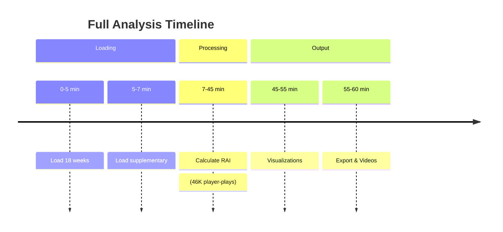
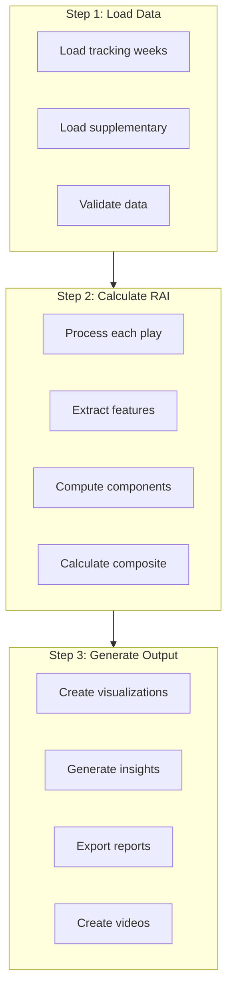

# 🏃 Running Analysis Guide

How to execute RAI analysis on NFL tracking data.

---

## 🚀 Quick Start

```bash
# Full analysis (all 18 weeks)
python analysis/rai_analysis.py

# Quick test (100 plays, no videos)
python analysis/rai_analysis.py --sample 100 --no-video

# Specific weeks only
python analysis/rai_analysis.py --weeks 1 2 3
```

---

## 📋 Command Line Options

| Option | Type | Default | Description |
|--------|------|---------|-------------|
| `--weeks` | list | All | Specific week numbers (1-18) |
| `--sample` | int | None | Number of plays to analyze |
| `--no-video` | flag | False | Skip video generation |
| `--output` | path | outputs/ | Custom output directory |
| `--verbose` | flag | True | Show detailed progress |

---

## 📊 Analysis Modes

### Full Analysis

```bash
python analysis/rai_analysis.py
```

Processes all 18 weeks, ~14,000 plays. Takes approximately **30-60 minutes**.



---

### Sample Analysis

```bash
python analysis/rai_analysis.py --sample 100
```

Quick testing mode. Takes approximately **2-5 minutes**.

> [!TIP]
> Use sample mode during development or testing

---

### Specific Weeks

```bash
# First 3 weeks
python analysis/rai_analysis.py --weeks 1 2 3

# Just week 10
python analysis/rai_analysis.py --weeks 10

# Playoff-relevant weeks
python analysis/rai_analysis.py --weeks 15 16 17 18
```

---

## 🔄 Analysis Pipeline



---

## 📁 Output Files

After analysis, check the `outputs/` directory:

```
outputs/
├── figures/
│   ├── rai_distribution.png     # Score distribution by role
│   ├── rai_components.png       # Component breakdown
│   ├── coverage_comparison.png  # Coverage type comparison
│   └── summary_dashboard.png    # Multi-panel dashboard
│
├── reports/
│   ├── rai_results.csv          # Full results (46K rows)
│   ├── player_rai_aggregates.csv # Per-player averages
│   └── insights.txt             # Key findings summary
│
└── videos/
    └── play_animations/         # MP4 play videos
```

---

## 📈 Output File Details

### rai_results.csv

| Column | Type | Description |
|--------|------|-------------|
| `gameId` | int | Game identifier |
| `playId` | int | Play identifier |
| `nflId` | int | Player identifier |
| `player_role` | str | Role (defender/receiver) |
| `rtd` | float | Reaction Time Delay |
| `te` | float | Trajectory Efficiency |
| `bpq` | float | Break Point Quality |
| `cms` | float | Coverage Maintenance |
| `sd` | float | Separation Delta |
| `rai` | float | Composite RAI score |

### player_rai_aggregates.csv

| Column | Type | Description |
|--------|------|-------------|
| `nflId` | int | Player identifier |
| `displayName` | str | Player name |
| `position` | str | Position |
| `team` | str | Team abbreviation |
| `plays` | int | Number of plays analyzed |
| `avg_rai` | float | Mean RAI score |
| `avg_rtd` | float | Mean reaction time |
| `avg_te` | float | Mean efficiency |

### insights.txt

Text file with key findings:

```
=== NFL RAI Analysis Insights ===

Total Plays: 14,108
Player-Plays Analyzed: 46,045
Unique Players: 1,178

Average RAI by Role:
- Defensive Coverage: 0.555 (σ=0.469)
- Targeted Receiver: 0.523 (σ=0.225)

Key Findings:
1. Average reaction time: 254ms (2.5 frames)
2. Elite performers react in under 200ms
...
```

---

## 🐍 Python API Usage

### Basic Usage

```python
from analysis.rai_analysis import RAIAnalysis

# Initialize
analysis = RAIAnalysis()

# Run with options
analysis.run_full_analysis(
    weeks=[1, 2, 3],    # Specific weeks
    sample_size=500,     # Limit plays
    create_videos=False  # Skip videos
)
```

### Step-by-Step Control

```python
# Step 1: Load data
analysis.load_data(weeks=[1, 2])

# Step 2: Calculate RAI
analysis.calculate_all_rai(sample_size=None)

# Step 3: Generate outputs
analysis.generate_insights()
analysis.create_visualizations()
analysis.export_results()

# Optional: Create videos
analysis.create_sample_video(n_plays=5)
```

### Access Results

```python
# Get results DataFrame
results_df = analysis.results_df

# Get insights dictionary
insights = analysis.insights

# Print summary
print(f"Plays analyzed: {len(results_df['playId'].unique())}")
print(f"Average RAI: {results_df['rai'].mean():.3f}")
```

---

## ⚡ Performance Optimization

### Memory Management

```python
# For large datasets, process in chunks
analysis = RAIAnalysis()

for week in range(1, 19):
    analysis.load_data(weeks=[week])
    analysis.calculate_all_rai()
    analysis.export_results()  # Writes incrementally
```

### Parallel Processing

The analysis automatically uses multiple CPU cores where possible.

| Operation | Parallelized |
|-----------|--------------|
| Data loading | Per-week parallel |
| Feature calculation | Per-player parallel |
| Video generation | Sequential (I/O bound) |

---

## 🔧 Troubleshooting

### Common Issues

| Issue | Cause | Solution |
|-------|-------|----------|
| `MemoryError` | Too much data | Use `--sample` flag |
| Slow processing | Full dataset | Process fewer weeks |
| Missing outputs | Path issues | Check `outputs/` exists |
| `KeyError` | Bad data | Verify data files |

### Verbose Logging

```bash
# Enable debug output
python analysis/rai_analysis.py --verbose
```

---

## ⏭️ Next

- **[Interpreting Results](interpreting-results.md)** - Understand RAI scores
- **[Dashboard Guide](dashboard-guide.md)** - Visualize results
